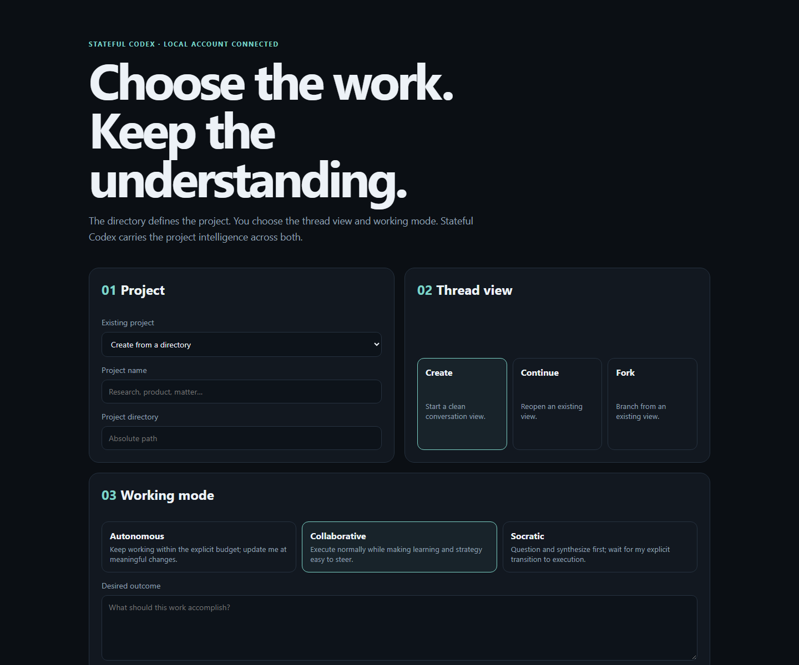
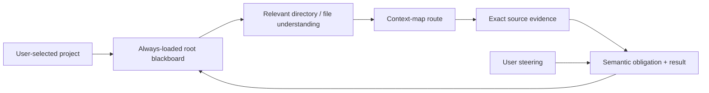

<div align="center">

# Stateful Codex

### Choose the work. Keep the understanding.

**A project-intelligence layer for Codex that carries structured understanding across long-running work, threads, and compaction.**

[Product intent](./STATEFUL_CODEX_PRODUCT_INTENT.md) · [Build plan](./STATEFUL_CODEX_BUILD_PLAN.md) · [Evaluation record](./STATEFUL_CODEX_EVALUATION.md) · [Web client](./clients/stateful-codex)


</div>

<p align="center">
  
</p>

Stateful Codex is an experimental fork of OpenAI Codex for complex work that
outlives one context window. It treats the user-selected directory as a durable
project, turns what the agent learns into queryable project intelligence, and
keeps consequential reasoning visible while the work is happening.

The aim is not “chat with memory.” It is an execution environment that becomes
better informed as the project develops—without making the user repeatedly
explain the project, reread the same corpus, or wait until the end to discover
what the agent did.

> [!IMPORTANT]
> Stateful Codex is a research preview. Its first complete product slice works
> through the native CLI and local browser UI, but evaluation is still active.
> The repository records regressions and unfavorable results alongside wins.

## What changes

- **The directory defines the project.** Stateful Codex never guesses which
  project a request belongs to. Threads are conversation views over the same
  project intelligence, not memory boundaries.
- **Hierarchical blackboards preserve understanding.** Project, directory,
  file, and optional anchored-region records retain facts, decisions,
  contradictions, open questions, failures, strategies, and relationships.
- **A separate context map routes back to ground truth.** Memory says what the
  system understands; the context map says where to verify it; source files
  remain authoritative.
- **Obligation packets explain the work semantically.** The UI reports what was
  learned, why it matters, what changed, what remains uncertain, and what comes
  next—instead of streaming an opaque tool-call transcript.
- **Steering is part of execution.** Users can redirect an active investigation,
  and the instruction, acknowledgement, application state, and resulting
  strategy revision remain visible.
- **Workflow mode is an explicit user choice.** Autonomous keeps working,
  Collaborative exposes meaningful checkpoints without creating approval
  gates, and Socratic questions and synthesizes before execution.
- **Normal Codex authentication still works.** The CLI and loopback-only web
  gateway use the account cached by `codex login`; Stateful Codex does not
  require a separate API key.



## What is working now

The current branch includes the first end-to-end product slice:

- durable project identity shared by new, resumed, and forked threads;
- bounded, typed model context that survives compaction;
- filesystem-shaped project intelligence with provenance, freshness, exact
  evidence, relationships, and revision-safe mutation;
- project-memory, context-map, evidence, obligation, steering, and completion
  tools available to the model;
- durable Autonomous, Collaborative, and Socratic workflows;
- native `codex --stateful <mode>` and `codex exec --stateful <mode>` paths;
- experimental app-server v2 APIs and revisioned events; and
- a real local browser client for setup, progress, steering, source evidence,
  findings, controls, recovery, and final results.

### More than a system prompt

The branch adds durable software boundaries rather than asking the model to
pretend it has memory. Project intelligence has its own SQLite-backed crate and
migrations; inference behavior is installed as a native extension; bounded
state reaches the model through typed World State contributions; mutations use
revision and idempotency contracts; app-server v2 owns the external API; and
the CLI, TUI, generated SDKs, browser gateway, web client, and evaluation
harnesses all consume those contracts. Ordinary Codex remains available when no
Stateful mode is selected or the intelligence store cannot be used.

## Evidence so far

These are measured signals, not a claim that Stateful Codex has already won
every workload or completed an official leaderboard submission.

| Evaluation | Encouraging result | Important limitation |
| --- | --- | --- |
| Terminal-Bench 2.1 one-attempt breadth screen | **70 of 89 distinct tasks passed (78.65%)**: 3/4 easy, 45/55 medium, and 22/30 hard. | This is directional pass-at-one evidence, not the published 445-trial protocol or an official leaderboard score. |
| Six-question, two-project matched series | Read-bearing calls fell **20 → 7**, unique raw-file reads **54 → 29**, and follow-up uncached input plus output **97,693 → 77,806** while all six answers and durable results passed manual semantic review. | Follow-up full tokens increased **381,853 → 430,830**; including project maturation, Stateful remained more expensive over this short series. |
| Mature-project selective retrieval | On three matched questions, Stateful used **5 read-bearing calls vs. 11** and reduced follow-up full tokens **19.41%** while verifying narrower source sets. | Uncached follow-up usage increased **27.90%**, and maturation-inclusive cost had not yet broken even. |
| Repeated-task feedback pilot | Early completed trajectories show cheaper later attempts, successful repair of some cold failures, and real reuse of prior findings and verifier outcomes. | The pilot is still incomplete; some tasks regress after passing, and `video-processing` remained both more expensive and incorrect. Final figures will be published only after the ledger is frozen. |

The public Codex 0.144.1 Luna-max Terminal-Bench submission reports 75.73% over
445 trials. Stateful Codex's 78.65% result across all 89 distinct tasks is an
encouraging signal, but the protocols and binaries differ, so the figures are
reported beside one another rather than treated as a controlled head-to-head.
The complete methodology, costs, task mix, failures, infrastructure repairs,
and negative findings are preserved in the
[evaluation record](./STATEFUL_CODEX_EVALUATION.md).

## Try it

Stateful Codex currently builds from source. Install the normal Codex
prerequisites, sign in once with your ChatGPT account, and build the branch CLI:

```powershell
codex login
cd codex-rs
cargo build -p codex-cli -p codex-code-mode-host
```

Run the native TUI from the directory that should define the project:

```powershell
.\target\debug\codex.exe --stateful collaborative "Map this project, identify the decisive open questions, and start resolving them."
```

Or start the browser client:

```powershell
cd ..\clients\stateful-codex
npm start
```

Then open `http://127.0.0.1:4173`. The first screen asks you to choose the
project, whether to create/continue/fork the thread view, the workflow mode, and
the desired outcome. The gateway binds only to loopback and launches the local
branch CLI with ChatGPT authentication.

## How to read this repository

- [`STATEFUL_CODEX_PRODUCT_INTENT.md`](./STATEFUL_CODEX_PRODUCT_INTENT.md)
  defines the user problem and is the highest-level source of truth.
- [`STATEFUL_CODEX_BUILD_PLAN.md`](./STATEFUL_CODEX_BUILD_PLAN.md) records the
  clean-build architecture, stage gates, and current implementation checkpoint.
- [`STATEFUL_CODEX_EVALUATION.md`](./STATEFUL_CODEX_EVALUATION.md) is the
  append-only evidence record, including negative results and invalidated runs.
- [`clients/stateful-codex`](./clients/stateful-codex) contains the browser
  client and reproducible evaluation harnesses.
- [`codex-rs/project-intelligence`](./codex-rs/project-intelligence) and
  [`codex-rs/ext/stateful`](./codex-rs/ext/stateful) own durable project
  knowledge and inference-time behavior without turning `codex-core` into the
  product database.

## Built on Codex

Stateful Codex is built on the open-source Codex CLI. The upstream Codex
quickstart and links are retained below for provenance and contributor context.

---

<p align="center"><strong>Codex CLI</strong> is a coding agent from OpenAI that runs locally on your computer.
<p align="center">
  
</p>
</br>
If you want Codex in your code editor (VS Code, Cursor, Windsurf), <a href="https://developers.openai.com/codex/ide">install in your IDE.</a>
</br>If you want the desktop app experience, run <code>codex app</code> or visit <a href="https://chatgpt.com/codex?app-landing-page=true">the Codex App page</a>.
</br>If you are looking for the <em>cloud-based agent</em> from OpenAI, <strong>Codex Web</strong>, go to <a href="https://chatgpt.com/codex">chatgpt.com/codex</a>.</p>

---

## Quickstart

### Installing and running Codex CLI

Run the following on Mac or Linux to install Codex CLI:

```shell
curl -fsSL https://chatgpt.com/codex/install.sh | sh
```

Run the following on Windows to install Codex CLI:

```shell
powershell -ExecutionPolicy ByPass -c "irm https://chatgpt.com/codex/install.ps1 | iex"
```

The standalone installers download from `https://releases.openai.com/codex` by default and fall back to GitHub Releases if a metadata or asset download is unavailable. To force GitHub Releases, set `CODEX_INSTALLER_USE_RELEASES_OPENAI_COM` to `false` (`0` and `no` are also accepted):

```shell
curl -fsSL https://chatgpt.com/codex/install.sh | CODEX_INSTALLER_USE_RELEASES_OPENAI_COM=false sh
```

```powershell
$env:CODEX_INSTALLER_USE_RELEASES_OPENAI_COM='false'; irm https://chatgpt.com/codex/install.ps1 | iex
```

Codex CLI can also be installed via the following package managers:

```shell
# Install using npm
npm install -g @openai/codex
```

```shell
# Install using Homebrew
brew install --cask codex
```

Then simply run `codex` to get started.

<details>
<summary>You can also go to the <a href="https://github.com/openai/codex/releases/latest">latest GitHub Release</a> and download the appropriate binary for your platform.</summary>

Each GitHub Release contains many executables, but in practice, you likely want one of these:

- macOS
  - Apple Silicon/arm64: `codex-aarch64-apple-darwin.tar.gz`
  - x86_64 (older Mac hardware): `codex-x86_64-apple-darwin.tar.gz`
- Linux
  - x86_64: `codex-x86_64-unknown-linux-musl.tar.gz`
  - arm64: `codex-aarch64-unknown-linux-musl.tar.gz`

Each archive contains a single entry with the platform baked into the name (e.g., `codex-x86_64-unknown-linux-musl`), so you likely want to rename it to `codex` after extracting it.

</details>

### Using Codex with your ChatGPT plan

Run `codex` and select **Sign in with ChatGPT**. We recommend signing into your ChatGPT account to use Codex as part of your Plus, Pro, Business, Edu, or Enterprise plan. [Learn more about what's included in your ChatGPT plan](https://help.openai.com/en/articles/11369540-codex-in-chatgpt).

You can also use Codex with an API key, but this requires [additional setup](https://developers.openai.com/codex/auth#sign-in-with-an-api-key).

## Docs

- [**Codex Documentation**](https://developers.openai.com/codex)
- [**Contributing**](./docs/contributing.md)
- [**Installing & building**](./docs/install.md)
- [**Open source fund**](./docs/open-source-fund.md)

This repository is licensed under the [Apache-2.0 License](LICENSE).
