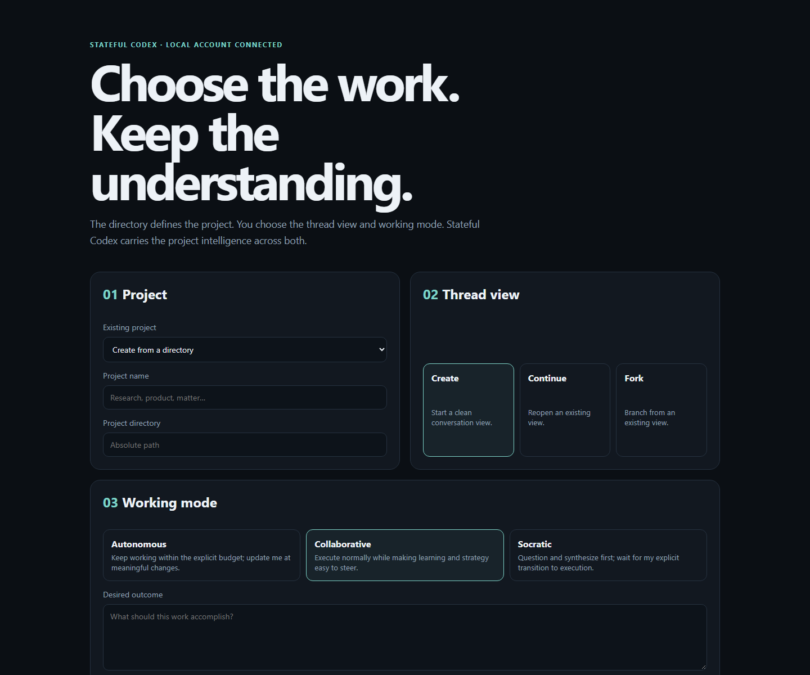

<div align="center">

# Stateful Codex

### Choose the work. Keep the understanding.

**A project-intelligence layer for Codex that carries structured understanding across long-running work, threads, and compaction.**

[Product intent](./STATEFUL_CODEX_PRODUCT_INTENT.md) · [Master plan](./STATEFUL_CODEX_MASTER_PLAN.md) · [Current state](./STATEFUL_CODEX_CURRENT_STATE.md) · [Evaluation record](./STATEFUL_CODEX_EVALUATION.md) · [Web client](./clients/stateful-codex)


</div>

Stateful Codex is an experimental fork of OpenAI Codex for complex work that
outlives one context window. The user-selected directory is a durable project.
What the agent learns becomes queryable project intelligence: hierarchical
blackboards of facts, decisions, contradictions and open questions, a separate
context map that routes back to exact source, and semantic progress updates the
user can steer while the work runs. It is not "chat with memory"; the goal is an
execution environment that becomes better informed as the project develops.

> [!IMPORTANT]
> Stateful Codex is a research preview. The published branch works through the
> native CLI and a local browser client; all work lands on `main`, and
> evaluation is active. The evaluation record keeps
> regressions and unfavorable results beside wins.

## Evidence so far

Measured signals, not leaderboard submissions or controlled causal claims. The
[evaluation record](./STATEFUL_CODEX_EVALUATION.md) has methods, costs,
failures and limits; [current state](./STATEFUL_CODEX_CURRENT_STATE.md) says
which build each result came from.

**One general harness, competitive with specialised ones.** On public benchmarks, Stateful Codex runs one
unchanged harness across OpenAI, Google and DeepSeek models. With the same model, it scores within about 5 points of
each model's or benchmark's own published harness on Terminal-Bench 2.1, SWE-bench Verified and DeepSWE. It is ahead
on several of them, for example Luna on TB2.1: 76.6% against 75.7% for released Codex. The exception is DeepSeek V4.1
Flash, which trails DeepSeek's own 1M-context harness at max effort: 83.9% against 90.6% on TB2.1, and 61.1% against
74.2% on DeepSWE. Most of that gap is timeouts from long reasoning. On memory-native MemoryArena it leads every
published number we found. Details, caveats and judges: [SC-EVAL-037](./STATEFUL_CODEX_EVALUATION.md).

| Evaluation | Observed result | Important limitation |
| --- | --- | --- |
| October hands-on campaign (SC-EVAL-035, unmerged candidate builds) | Across 20 fresh-thread sessions, Stateful used 0.73x-0.89x the ordinary input; a standing rule held 7/20 on the earlier candidate and 20/20 on the two later ones, against 1/20. Within one run costs stayed higher: blind reviews preferred ordinary on two long runs, and a 12-turn replay cost 1.27x with 23 against 18 compactions, though its blind review preferred Stateful and it recalled never-restated facts 2/3 against 0/3. | n=1 per arm; the cross-session gain depends on the ordinary arm's re-asks (0.83x-0.97x without them); the first session costs more. |
| 25-question model eval, GPT-6.1 Sol (SC-EVAL-034) | 13.4% cheaper ($1.422 against $1.641 list-price equivalent) and 12.3% faster, same objective score (10/10); more expensive on small one-shot batches (+89%, +55%). | One run per arm. Same-day negatives: stale memory served as current (0/10 against 7.5/10) and compaction lost numbers told to the user (0/4 against 3/4). |
| One continuous thread, ten questions (SC-EVAL-032) | Stateful used 2.0x the input and 2.7x the uncached input; blind quality was level (6/10 preferred ordinary). | Inside one thread the conversation already serves as memory. |
| Fresh session per question (issue #35) | 20-54% fewer tokens after the first session across analyst, coding, web, research and RTL repositories. | Single hands-on series; the metric excludes cached input. |
| Terminal-Bench 2.1, one attempt per task | 70/89 (78.65%) on the original bundle; 68/89 (76.40%) on the later Phase A freeze. | Not the 445-trial protocol or an official score; the public Codex 75.73% comes from a different build. |
| Feedback-conditioned pilot, 50 attempts (SC-EVAL-030) | Fifth attempts cost 22.0% less than cold attempts and passed 7/8 against 5/8. | No repeated ordinary arm; regressions occurred; `video-processing` failed all five attempts. |
| BixBench v1.5-compatible gates (SC-EVAL-031) | 4/5 on one capsule; 3/10 local matches and 2/10 correct and valid on ten capsules. | Not the official image or judge; no ordinary control. |

Machine-readable records:
[Terminal-Bench feedback pilot](./clients/stateful-codex/eval/results/terminal-bench-2-1-feedback-pilot-50-20260923.json)
and [BixBench gates](./clients/stateful-codex/eval/results/bixbench-v1-5-compatible-gates-20260924.json).

## Try it

Stateful Codex builds from source. Sign in once with your ChatGPT account, then
build the CLI and its code-mode companion from the same checkout; they must sit
beside each other, as in a normal Codex package:

```powershell
codex login
cd codex-rs
cargo build -p codex-cli -p codex-code-mode-host
```

Run the native TUI from the directory that should define the project:

```powershell
.\target\debug\codex.exe --stateful collaborative "Map this project, identify the decisive open questions, and start resolving them."
```

`codex exec --stateful <mode>` runs headlessly. Modes are `autonomous`,
`collaborative` and `socratic`.

Or start the browser client and open `http://127.0.0.1:4173`:

```powershell
cd ..\clients\stateful-codex
npm start
```

The first screen asks for the project, whether to create, continue or fork the
thread, the workflow mode, and the desired outcome. The gateway binds only to
loopback, uses the login cached by `codex login`, and strips API-key variables
from the server it launches; it never needs an API key. Set `CODEX_BIN` only
when the branch CLI is elsewhere.

<p align="center">
  
</p>

## How to read this repository

- [`STATEFUL_CODEX_PRODUCT_INTENT.md`](./STATEFUL_CODEX_PRODUCT_INTENT.md): the
  user problem and requirements; the highest-level source of truth.
- [`STATEFUL_CODEX_MASTER_PLAN.md`](./STATEFUL_CODEX_MASTER_PLAN.md): the
  canonical build plan; its reference design is
  [`STATEFUL_CODEX_MEMORY_PLAN.md`](./STATEFUL_CODEX_MEMORY_PLAN.md).
- [`STATEFUL_CODEX_CURRENT_STATE.md`](./STATEFUL_CODEX_CURRENT_STATE.md):
  architecture, source reading path, unmerged branches, open gates and
  operating rules.
- [`STATEFUL_CODEX_EVALUATION.md`](./STATEFUL_CODEX_EVALUATION.md): the
  append-only evidence record, including negative and invalidated runs.
- [`LONGITUDINAL_PROTOCOL.md`](./clients/stateful-codex/eval/LONGITUDINAL_PROTOCOL.md),
  [`bixbench/README.md`](./clients/stateful-codex/eval/bixbench/README.md) and
  [`stateful_harbor/README.md`](./clients/stateful-codex/eval/stateful_harbor/README.md):
  evaluation methods and harness commands.
- [`clients/stateful-codex`](./clients/stateful-codex): the browser client and
  evaluation harnesses. [`codex-rs/project-intelligence`](./codex-rs/project-intelligence)
  and [`codex-rs/ext/stateful`](./codex-rs/ext/stateful) own durable project
  knowledge and inference-time behavior outside `codex-core`.

## Built on Codex

Stateful Codex is built on the open-source Codex CLI. The upstream Codex
quickstart and links are retained below for provenance and contributor context.

---

<p align="center"><strong>Codex CLI</strong> is a coding agent from OpenAI that runs locally on your computer.
<p align="center">
  
</p>
</br>
If you want Codex in your code editor (VS Code, Cursor, Windsurf), <a href="https://developers.openai.com/codex/ide">install in your IDE.</a>
</br>If you want the desktop app experience, run <code>codex app</code> or visit <a href="https://chatgpt.com/codex?app-landing-page=true">the Codex App page</a>.
</br>If you are looking for the <em>cloud-based agent</em> from OpenAI, <strong>Codex Web</strong>, go to <a href="https://chatgpt.com/codex">chatgpt.com/codex</a>.</p>

---

## Quickstart

### Installing and running Codex CLI

Run the following on Mac or Linux to install Codex CLI:

```shell
curl -fsSL https://chatgpt.com/codex/install.sh | sh
```

Run the following on Windows to install Codex CLI:

```shell
powershell -ExecutionPolicy ByPass -c "irm https://chatgpt.com/codex/install.ps1 | iex"
```

The standalone installers download from `https://releases.openai.com/codex` by default and fall back to GitHub Releases if a metadata or asset download is unavailable. To force GitHub Releases, set `CODEX_INSTALLER_USE_RELEASES_OPENAI_COM` to `false` (`0` and `no` are also accepted):

```shell
curl -fsSL https://chatgpt.com/codex/install.sh | CODEX_INSTALLER_USE_RELEASES_OPENAI_COM=false sh
```

```powershell
$env:CODEX_INSTALLER_USE_RELEASES_OPENAI_COM='false'; irm https://chatgpt.com/codex/install.ps1 | iex
```

Codex CLI can also be installed via the following package managers:

```shell
# Install using npm
npm install -g @openai/codex
```

```shell
# Install using Homebrew
brew install --cask codex
```

Then simply run `codex` to get started.

<details>
<summary>You can also go to the <a href="https://github.com/openai/codex/releases/latest">latest GitHub Release</a> and download the appropriate binary for your platform.</summary>

Each GitHub Release contains many executables, but in practice, you likely want one of these:

- macOS
  - Apple Silicon/arm64: `codex-aarch64-apple-darwin.tar.gz`
  - x86_64 (older Mac hardware): `codex-x86_64-apple-darwin.tar.gz`
- Linux
  - x86_64: `codex-x86_64-unknown-linux-musl.tar.gz`
  - arm64: `codex-aarch64-unknown-linux-musl.tar.gz`

Each archive contains a single entry with the platform baked into the name (e.g., `codex-x86_64-unknown-linux-musl`), so you likely want to rename it to `codex` after extracting it.

</details>

### Using Codex with your ChatGPT plan

Run `codex` and select **Sign in with ChatGPT**. We recommend signing into your ChatGPT account to use Codex as part of your Plus, Pro, Business, Edu, or Enterprise plan. [Learn more about what's included in your ChatGPT plan](https://help.openai.com/en/articles/11369540-codex-in-chatgpt).

You can also use Codex with an API key, but this requires [additional setup](https://developers.openai.com/codex/auth#sign-in-with-an-api-key).

## Docs

- [**Codex Documentation**](https://developers.openai.com/codex)
- [**Contributing**](./docs/contributing.md)
- [**Installing & building**](./docs/install.md)
- [**Open source fund**](./docs/open-source-fund.md)

This repository is licensed under the [Apache-2.0 License](LICENSE).
