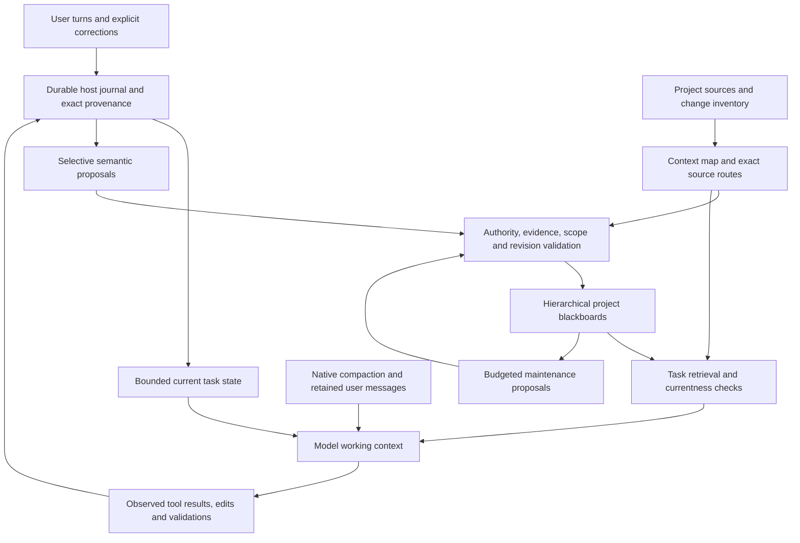

# Stateful Codex memory and harness improvement plan

Updated: 2026-10-06. Status: evidence-backed design; fresh Codex, Droid and Antigravity reviews passed. This document proposes future work. No implementation, benchmark rerun, deployment, or issue closure is authorized or claimed by this planning pass.

## 1. Outcome, scope, and authority

Make accumulated project understanding produce better decisions and insights at lower lifetime cost, survive compaction and restart, stay current under other people's edits, and remain understandable and steerable. Preserve the filesystem hierarchy and a rich project-wide blackboard. Changing memory alone is insufficient: capture, tool navigation, context construction, run ownership, compaction, maintenance, and evidence accounting form one system.

The deliverable is this one document. Code, schemas, dependencies, protected experiments, and existing documentation remain unchanged. Documentation corrections discovered during inspection are collected here so the plan is self-contained rather than spread across additional files. Computer use, additional providers, and video ingestion follow the memory gates; existing document extraction is relevant now because its cost is already part of the memory evidence.

Evidence authority:

- **Local source:** branch `feature/stateful-codex`, commit `4ea34e7d1058c2f64620596d91393b25a5137833`. Tracked working tree was clean at intake. Existing untracked `.blackboard/`, `s2_design_review1.md`, and the two protected evaluation directories are not deliverables and must not be altered.
- **Published documentation:** GitHub `dl1683/stateful-codex/main`, the `stateful` remote, resolved to `5eacf03387cd56d149b2775a21a59b0f04274907` at intake and again during final review. Its SC-EVAL-034 documentation is newer than this checkout. The separate `origin` remote is `openai/codex`; its live main is `404cd42aa5254af56a6080af1a775f730ac6b7d0`, not a replacement pin for the published Stateful evaluation. Neither remote observation establishes that all remote source matches local source.
- **Live issues:** issue snapshots and substantive comments were read through the GitHub connector on 2026-10-06. Search results omit state; individually fetched issue snapshots establish open/closed status.
- **External experiments:** `C:/Users/devan/sc_dogfood/campaign2/` contains newer reports, including tests of `q1b3_ece895ce37` and other builds. Their observations are evidence about those binaries, not automatically reproductions on the local commit. They are read-only inputs.
- **Prior design work:** October 2–3 council documents are useful proposals, not proof of implemented behavior or substitutes for the fresh reviews required here. This plan must stand without relying on their signatures.

The user intent in [STATEFUL_CODEX_PRODUCT_INTENT.md](STATEFUL_CODEX_PRODUCT_INTENT.md) governs the product. A database, a larger prompt, green component tests, or a faster index is not the outcome. The longitudinal task trajectory must improve.

## 2. What the evidence actually says

| Evidence | Verified observation or recorded result | Scope and consequence |
| --- | --- | --- |
| SC-EVAL-032, protected Pramana `metrics.json`, and [issue 15](https://github.com/dl1683/stateful-codex/issues/15) | One continuous ten-question thread: quality essentially level, Stateful more expensive and slower; compactions 4 versus 2. Frozen artifact sums differ from the documentation table: input 25,089,552 versus 12,572,326; uncached 1,427,344 versus 512,678; output 149,511 versus 107,259. Historical price estimates approximately $18.1643 versus $9.0197. | Preserve both the table and artifact disagreement; do not silently combine denominators. This predates several current continuity mechanisms. It establishes the original failure and the need for a matched current rerun, not a permanent failure of every version. |
| Issue 15 selector rollback and completed-outcome replay comments | A root salience slate failed its coverage gate and was removed; all promoted root instances were already visible. Current bounded outcomes supplied a useful q06 counterfactual; q10 needed an uncaptured source detail. | Ranking cannot recover knowledge never captured. Repeated ranges are opportunity signals, not proof that every reread is waste. Do not resurrect the rejected slate as a default without a new displacement experiment. |
| SC-EVAL-033 in [STATEFUL_CODEX_EVALUATION.md](STATEFUL_CODEX_EVALUATION.md:3443) | Three replicated data-room comparisons favored fresh-thread Stateful synthesis; short asks paid about twice the uncached tokens and 2.2 times the responses. Code-study ranking flipped; small tool builds had equal hidden-check results and extra Stateful cost. | Benefits depend on workload and thread regime. Notes-file controls narrow the claimed advantage. A short correct answer is not evidence of better insight. |
| [Issue 35](https://github.com/dl1683/stateful-codex/issues/35) and comments | Fresh-session analyst, code, research, JS, and RTL series often saved tokens after learning; research series were interleaved, and some Stateful answers were shorter with weaker citations. | Keep brevity, exposure to earlier runs, and invalid timing windows explicit. These are promising observations rather than a general causal estimate. |
| E12 corrected lifetime evidence in campaign `FINDINGS.md` | Repeated Office facts could be cheaper, but the 12-session Stateful total remained 7–48% higher; break-even was beyond two re-asks in three of four runs. Cheap text re-reads remained competitive. | Correct the older approximately-two-re-asks narrative. Charge initial extraction, capture, and subsequent reads. Prefer selective extraction reuse where re-extraction is expensive. |
| [SC-EVAL-034, published main](https://github.com/dl1683/stateful-codex/blob/5eacf03387cd56d149b2775a21a59b0f04274907/STATEFUL_CODEX_EVALUATION.md) | GPT-6.1 Sol five-batch study: price-equivalent $1.422 versus $1.641, objective score 10/10 both; small batches cost more. Same-day negative tests recorded stale-current answers, historical-number failures, and only 2/4 future instruction compliance despite instruction entries in all four Stateful stores. | One run per arm, different harness builds, later batches dependent on earlier state, and only two batches objectively scored. Prices were equivalents under ChatGPT login, not bills. Distinguish capture failure from application failure. |
| `campaign2/cmp1/REPORT.md`, reconciled against six raw rollouts | Three threads per arm, 45 total real compactions: both recovered historical counts; Stateful cost 1.48 times synthetic units, wall time 1.31 times, compactions 1.81 times. Native compaction accounted for 29% of the excess as accounting, not isolated cause. | Exec/resume, one Click workload at 50k, not all surfaces. Native compaction was at ceiling on these probes. Stateful outcomes remained at turn 1 because resumed turns opened no new run. A shadow builder had no established downstream advantage and cost 9.7–13.5% of a whole thread per invocation. |
| `campaign2/rp16` and `FINDINGS.md` | Harder historical-recall probes after three compactions: base 0/18, Stateful 3/18; the successful Stateful facts came from the initial outcome. Immediate compact tests and cmp1 had ceiling results. | Probes are correlated within three threads per arm; source mutation invited re-derivation. The disagreement with cmp1 remains unexplained. Use both regimes and distinguish exact past delivery from present truth. |
| `campaign2/cap1/REPORT.md` | 47 cases: marker-bearing promoted capture in 14/36 standing cases; initial exposure correlated with obedience, but some exposed rules were ignored. Follow-ups often had no run. Reversal left withdrawn text in older outcomes. | One fixture/model, 1–3 per cell, phrasing/position/surface confounded. There is no complete host project-rule path in that tested build. Storage, exposure, authority, scope, and obedience require separate gates. |
| `campaign2/tui6/REPORT.md` | Simulated working day, one pair: 18 turns each but only four Stateful runs; no instruction entries; fabricated preferences persisted in a run result; total tokens 2.27 times, uncached 1.43 times, output 1.51 times, busy time 1.50 times. | Includes compaction usage omitted by a simpler tally. Unequal final work and simulated timing prohibit a pure memory-cost attribution. Same-thread rule obedience was equal. Forget was not tested as storage erasure. |
| `campaign2/acl1/REPORT.md` | Scoped project memory queries held. Tested Windows read-only/workspace-write profiles allowed sibling files and store/rollout reads; outside content was persisted into public-project blackboard/outcomes. Path reuse and junction re-point reused old memory. | 1–2 per cell, existence proofs. Same-user trusted RPC confirmation is not a demonstrated authority bypass. Browser DNS rebinding itself was not tested. Explicit machine-wide exploration is not a demonstrated violation of repo-only intent. |
| `campaign2/sm2/rv/results_final.txt` | Add-only shadow maintenance reduced some qualification loss, but guard-induced critical omissions occurred in 6/26 outputs; dangling references and empty slots remained. Reported gains used a post-run amended guard. Installation and downstream continuation untested; modeled economics uncertain. | Keep maintenance shadow-only. The reused 13 windows are not unseen holdouts. Number membership is not entailment, and cheaper worker calls do not demonstrate total-system savings. |
| Terminal-Bench breadth/regression and feedback pilot | 70/89 older breadth and 68/89 regression are one-attempt unofficial screens. Feedback JSON reconciles 50 attempts, 40 passes, 10 failures, 2 missed mutations, 9 retries; later attempts had directional improvement. | Different published builds and absent ordinary repeated-control arm prevent causal memory claims. Warm feedback is not the same experiment as fresh-session knowledge reuse. Memory benchmark scoring waits on frozen read-only knowledge integrity. |

Source-reading and artifact reconciliation in this planning pass do not constitute new product runtime validation. Preserve raw reports, unfavorable runs, incomplete attempts, and judge corrections. Do not compress conflicting results into “memory works” or “compaction loses everything.”

## 3. Codebase map and current mechanisms

The repository was inventoried across Rust crates, clients, SDKs, packaging, tests, and build definitions. Deep inspection concentrated on the memory-to-harness path; this is not a claim that every generated schema, fixture, vendored file, or unrelated subsystem received line-by-line review.

| Boundary | Existing ownership and behavior | Design implication |
| --- | --- | --- |
| Agent/runtime | `codex-rs/core`, `core-api`, extension API, tools, model/provider/client crates | Core owns sampling and context lifecycle. Keep reusable memory/storage logic outside the already large core; add narrow generic lifecycle contracts where needed. |
| Selected project | `state`, `thread-store`, app-server project APIs | Project selection is explicit. Directory paths are routing inputs, not sufficient durable identity or confidentiality boundaries. |
| Structured project knowledge | [project-intelligence/src/lib.rs](codex-rs/project-intelligence/src/lib.rs), hierarchy, context map, blackboard storage/search, indexer | Preserve project → directory → file → generic anchored region. Entries already have kinds, importance, lifecycle, provenance, evidence, and premise links. Do not create separate domain hierarchies. |
| Project integration | [ext/stateful/src/lib.rs](codex-rs/ext/stateful/src/lib.rs:132), root/run/outcome World State, tools, freshness, receipts, completion | Resolves project state at sampling. Latest five completed outcomes are already projected; root evidence audits use a turn-local cache. Tool outputs are bounded at 9,000 bytes. Current root selection is importance/identity ordered, not a demonstrated task-semantic retriever. |
| Evidence | [project-intelligence/src/evidence.rs](codex-rs/project-intelligence/src/evidence.rs), extension evidence receipts | Typed fingerprint-pinned routes and exact ranges exist. Reads can scan/hash a whole file for a tiny returned range. Source-reviewed is evidence of read provenance, not automatic semantic truth. Receipt storage is bounded and process-local. |
| Runs and completion | [stateful-runtime/src/lib.rs](codex-rs/stateful-runtime/src/lib.rs), app-server stateful processor/store, extension autonomy/checkpoint/completion | Durable runs, obligations, steering, leases, outcomes, measurements exist. They do not automatically cover every TUI/exec follow-up. Eight-call checkpoint nudges are not crash-safe semantic capture. Completion checks cannot make omitted facts reappear. |
| History/compaction | `history`, `core/context`, `core/session`, local/remote/token-budget compaction, rollout persistence | Multiple paths retain different content. Host retained-context families serve delegated authorization; an empty `verified_answers` field is not evidence of missing project conclusions. |
| Global personal memory | `memories/read`, `memories/write`, `ext/memories` | Startup rollout extraction and asynchronous global consolidation already exist, independently of project blackboard maintenance. Do not merge authority or ownership silently across these systems. |
| Surfaces | `app-server-protocol`, `app-server`, `app-server-client`, `cli`, `exec`, `tui`, local browser gateway | Public JSON-RPC is the integration boundary. Web has richer obligation/steering display; TUI follows different run paths. Client renderings must reveal the same captured/revoked/current state. |
| Input and tools | attachments, image preparation, user-input audio/image variants, code-mode, MCP, connectors, exec-server | Native attachment support is not a provenance-aware document/video memory system. Reuse these interfaces later rather than route every modality through ad hoc shell extraction. |
| SDK/distribution | TS SDK wraps CLI JSONL; Python SDK/runtime, npm native launcher, Cargo/Bazel, package assembly | Compatibility includes event shapes, config, CLI flags, existing rollouts, executor/app-server OS separation, migration identity, and companion binary availability. |

A crucial distinction is three different “memories”: conversation/history continuity; selected-project structured knowledge; and personal cross-project memory. The selected project must not inherit unrelated knowledge solely because a global pipeline, a reused path, or a readable sibling store made it available.

**Global personal-memory admission:** apply project-origin and retention controls before rollout extraction, consolidation, storage and every later prompt injection, not just when querying the blackboard. [Startup extraction](codex-rs/memories/write/src/phase1.rs:130) selects historical rollouts, while [the global extension](codex-rs/ext/memories/src/extension.rs:56) can inject a consolidated summary as developer context. Each extracted unit retains source event/thread/project incarnation, confidentiality/export scope, user/agent/source attribution, applicable retention, authorization and correction revision. Project facts default to their original project scope. Merely enabling global memory, reading a source or calling something a personal preference does not authorize exporting project-confidential facts. Keep extraction/consolidation inputs and outputs partitioned by admitted scope; a worker cannot broaden it by paraphrasing, joining records or writing a shared summary.

Genuinely cross-project personal preferences/facts require an existing explicit user/global-memory authorization that covers that kind of content and scope, or an exact selected save/import action. Inferred preferences remain attributed proposals when that authority is absent or ambiguous; they never become binding rules from an extraction label. Explicit standing instructions additionally follow section 6.2's exact source/content admission. Before building any request, the host filters global records against the current user, selected project, scope, origin admission, retention and current correction/tombstone revisions. Construct bounded typed, attributed data fragments separately from fixed host policy; arbitrary memory text cannot become higher-priority instructions merely because the current extension uses a developer message. Retrieval, summaries, caches, worker inputs and exact locators obey the same access/export predicate. A source-authorized, destination-authorized selected transfer follows section 8.2; readable paths alone are insufficient.

Existing unlabelled or mixed-scope global summaries are quarantined from automatic injection and cross-project consolidation. Reclassify only from attributable source records plus valid scope authorization; where paragraphs cannot be separated safely, defer the whole mixed unit rather than guess or silently export it. Exact historical archives retain their original ownership/access/retention; quarantine is not erasure. Previously contaminated native summaries require the legacy mixed-origin prompt boundary in section 8.2, not a claim that filtering new global fragments purges old context. Correction/forget records share stable source/derived identities across project and personal stores; revoke active derived copies, invalidate cached/consolidated views and prevent background re-extraction from restoring a tombstoned rule or fact. Expose projection debt and distinguish active removal from actual historical erasure. Mandatory admitted rules with unavailable safe coverage stop dependent admission; optional unavailable personal material is omitted with truthful status. Ephemeral rollouts cannot feed an automatic durable global pipeline. Charge migration/reclassification, filtering, consolidation and user review to the same lifetime ledger.

## 4. Live issue register and documentation corrections

| Issues | State refreshed during this pass | Place in this plan |
| --- | --- | --- |
| [15](https://github.com/dl1683/stateful-codex/issues/15), [16](https://github.com/dl1683/stateful-codex/issues/16), [17](https://github.com/dl1683/stateful-codex/issues/17), [19](https://github.com/dl1683/stateful-codex/issues/19) | Open; multiple narrow mechanism fixes landed | Capture/use/compaction, change coverage, exact routing, index economics remain product gates. |
| [18](https://github.com/dl1683/stateful-codex/issues/18), [20](https://github.com/dl1683/stateful-codex/issues/20), [21](https://github.com/dl1683/stateful-codex/issues/21), [22](https://github.com/dl1683/stateful-codex/issues/22), [23](https://github.com/dl1683/stateful-codex/issues/23) | Closed | Preserve guarded-read accounting, revision-consistent projection, receipt-based verification, exact browser routes, and host user-confirmation boundary as regression requirements. Do not reopen them based on obsolete descriptions. |
| [24](https://github.com/dl1683/stateful-codex/issues/24), [33](https://github.com/dl1683/stateful-codex/issues/33), [36](https://github.com/dl1683/stateful-codex/issues/36) | Open | Existing progress/measurements are partial; reconcile live counters with rollouts, separate internal operations, support document evidence, and avoid fabricated monetary cost. |
| [26](https://github.com/dl1683/stateful-codex/issues/26), [29](https://github.com/dl1683/stateful-codex/issues/29), [30](https://github.com/dl1683/stateful-codex/issues/30), [31](https://github.com/dl1683/stateful-codex/issues/31), [43](https://github.com/dl1683/stateful-codex/issues/43) | Open | Startup/store version compatibility, migration/backfill reliability, and actionable first-use setup. Local source has remediation for some historical failures; live gates remain distinct. |
| [27](https://github.com/dl1683/stateful-codex/issues/27), [28](https://github.com/dl1683/stateful-codex/issues/28), [34](https://github.com/dl1683/stateful-codex/issues/34), [39](https://github.com/dl1683/stateful-codex/issues/39), [41](https://github.com/dl1683/stateful-codex/issues/41), [46](https://github.com/dl1683/stateful-codex/issues/46) | Open | Cross-surface threads, truthful mode transitions, follow-up run admission, and reliable resume. Starting a run or changing status is not submitting work. |
| [32](https://github.com/dl1683/stateful-codex/issues/32), [35](https://github.com/dl1683/stateful-codex/issues/35), [40](https://github.com/dl1683/stateful-codex/issues/40), [42](https://github.com/dl1683/stateful-codex/issues/42) | Open reports/evidence | Cost-quality tradeoff, exact citations, and quality loss despite cheap output. A green fixture or lower spend is insufficient. |
| [37](https://github.com/dl1683/stateful-codex/issues/37), [47](https://github.com/dl1683/stateful-codex/issues/47) | Open | Writer contention, connection starvation, retryable durable completion, and honest task-versus-storage status. |
| [38](https://github.com/dl1683/stateful-codex/issues/38) | Closed | Historical missing notification arms are present locally. This pass did not build the TUI. Required package builds prevent recurrence. |
| [44](https://github.com/dl1683/stateful-codex/issues/44), [45](https://github.com/dl1683/stateful-codex/issues/45), [48](https://github.com/dl1683/stateful-codex/issues/48) | Open | Reproducible per-commit packages/build identity, model compatibility, and long prompt versus bounded goal distinction. Version gating in issue 45 is a hypothesis, not established cause. |
| [25](https://github.com/dl1683/stateful-codex/issues/25) | Open | Secondary providers/tools/computer use after memory gates. |
| [1](https://github.com/dl1683/stateful-codex/issues/1), [2](https://github.com/dl1683/stateful-codex/issues/2), [3](https://github.com/dl1683/stateful-codex/issues/3) | 1 closed; 2 and 3 open, individually refreshed | Stdin behavior, Windows shell launch, concurrent source changes, companion packaging. Issue closure is not new regression evidence from this pass. |

Corrections incorporated here, without rewriting historical documents:

1. September handoff paragraphs describe different checkpoints, including already-committed work as uncommitted and issue 38 as unfixed. Use live Git and issue snapshots for current state.
2. The old SC-EVAL-032 “outcomes not projected” finding describes that run. Local source now projects bounded completed outcomes. It remains unproved that the mechanism solves representative continuity and cost.
3. `codex-rs/memories/README.md` points Phase 1/2 orchestration at missing `core/src/memories/`; actual ownership is `memories/write/src/start.rs`, `phase1.rs`, and `phase2.rs`.
4. The local evaluation ledger stops at SC-EVAL-033, while published main contains SC-EVAL-034 and external campaigns contain later raw reports. Do not label local README figures as the latest evidence.
5. Preserve the corrected E12 lifetime break-even and SC-EVAL-032 metric disagreement. Exec terminal totals can omit compaction responses. Synthetic units, list-price equivalents, and actual billing are different quantities.
6. Distinguish point-of-use source hashing from coverage of all possible controlling sources. A fresh cited paragraph does not prove that no newer status file, qualifier, correction, or governing instruction supersedes it.
7. `/memory-maintenance` TUI stubs and web maintenance prompts are not a project maintenance scheduler. Global personal-memory consolidation is implemented separately.

## 5. Target architecture and non-negotiable invariants

Invariants apply to the full loop:

- In durable mode, preserve exact observed deliveries, user turns, source identities, and host receipts on disk. Ephemeral mode uses the explicit retention contract below. Do not promise preservation of private reasoning or tool bytes already truncated upstream.
- Separate historical “what was said/measured then” from current “what is true now.” Changed source does not rewrite a historical measurement; unchanged source does not make an obsolete conclusion current.
- User authority comes from a host-observed action with scope, exact text, source order, and lifecycle. Model and maintenance interfaces cannot award it; protection against tool-process tampering additionally requires the qualified storage-integrity boundary in section 10. Source documents can contain quoted instructions without becoming instructions to the agent.
- Keep the complete bounded rich root blackboard loaded in the model context across tasks and compactions, as required by the existing product contract. Remove duplicate run/outcome representations, not root findings that might support an unprompted connection. Searchable availability does not substitute for root exposure.
- Every injected item has a hard serialized and token bound, omission metadata, and a valid retrieval path. Every item potentially over 1,000 tokens receives the required manual context review; no injected item exceeds 10,000 tokens.
- Preserve append-only ordinary history. Context replacement occurs through the established compaction boundary, with durable checkpoint linkage; never rewrite previous messages during a normal turn to improve caching.
- Durable acknowledgement means the required store operation completed to its stated durability level. Process crash and machine/power-loss guarantees are different; a buffer flush is not automatically power-loss durability.
- Project identity, source scope, and current store schema are validated before injecting old knowledge. Persisted external content requires explicit scope/authority handling, not merely a readable path.
- Model budgets, continuations, and modes remain user-chosen. Internal maintenance cannot change the user's goal, silently authorize work, or fake a paused/blocked task because its own write failed.

### 5.0 Retention capability before admission

Resolve durable versus ephemeral retention before accepting work and expose the capability consistently across CLI/TUI/web/headless. Existing [ephemeral configuration](codex-rs/core/src/config/mod.rs:936) means the session is not persisted on disk; [initialization](codex-rs/core/src/session/session.rs:989) creates no live persistent thread. Preserve that meaning.

Durable sessions use the disk journal, canonical checkpoint protocol and qualified process-crash/restart guarantees in this plan. Ephemeral sessions instead use an in-memory ordered journal/checkpoint and current-authority fence, with no automatic durable session archive, transcript-derived background extraction, or crash/restart continuity claim. Ordinary authorized filesystem actions remain ordinary actions; ephemeral is a retention mode, not a new read-only sandbox. Request/dispatch deduplication is process-local and receipts identify their volatile status. A restart is a new session; do not pretend to recover its lost volatile history.

Reading explicitly selected project memory remains possible. A separately authorized project-memory save can persist the selected knowledge, minimum exact supporting excerpt/receipt, scope and provenance, without persisting the whole ephemeral transcript. An explicit user save command or an already established explicit project-retention policy supplies authorization; do not ask again. Make that policy visible before admission. Automatic transcript/journal publication is disabled in ephemeral mode. Never leave persistent locators pointing to discarded volatile events; authorized saves must copy their required minimal support into the scoped project record and report what was retained. Reusable project saves do not acquire user-confirmed authority from model inference.

Reject an incompatible combination, such as requested durable crash recovery with ephemeral retention, before accepting that mode; offer its supported disposition explicitly. Apply the same contract to fork/resume, native/local/token-budget compaction, optional global-memory input/output, internal workers and all surfaces. Test that ephemeral user/tool history is not automatically archived, that unrequested project saves do not occur, that authorized saves retain only their scoped support, and that current authority/fit guarantees still apply while the process lives. Every durable-acknowledgement or restart requirement below is conditional on durable capability; an ephemeral acknowledgement names its in-memory guarantee. Retention flags and established API defaults are compatibility requirements, not permission to silently upgrade storage.

### 5.1 Aggregate context fit and bounded fallback

Budget the final request against the effective model input window, reserving configured output capacity, provider-required overhead, and a measured tool-result continuation allowance. Count schemas, ordinary history, native retained items, root/rules/run/outcomes, capsule, amendments, and serialization wrappers together. Unknown model capacity must be resolved before enabling this policy; do not substitute an optimistic estimate. Use the actual tokenizer or a conservative byte-as-token bound. Enforce the 10,000-token injected-item limit **after** [adjacent fragments are merged](codex-rs/core/src/context_manager/updates.rs:32); split newly constructed items at typed boundaries while preserving order, never rewrite ordinary history.

Starting experimental ceiling for memory-derived active context: the smaller of 8,000 tokens and 10% of the effective input capacity. Binding rules and the latest authority corrections count toward it. The same accounting covers accumulated amendments already in ordinary history: crossing the ceiling requests a normal compaction boundary rather than silently deleting history. The ceiling is a candidate parameter, not a measured optimum or permission to shrink the root. Every normal request retains the complete bounded root. If the root and mandatory view cannot fit under the effective policy, report the incompatibility; a subset is not an automatic fallback. Finite recall trials cannot authorize changing the always-loaded-root product requirement.

For a request that does not fit: first remove optional duplicate representations and optional discovery/detail pages, then paginate optional outcome/finding detail with stable locators and omissions. Never omit an applicable binding rule, authority revocation, project identity, pending operation needed for safe execution, or the latest user request. Attempt at most one compaction of the ordinary history and one measured fallback construction per boundary. The full Stateful fallback is eligible only if its final measured request fits; a failed capsule does not justify an even larger unchecked request. Do not recursively compact the same unchanged input or clip a native opaque item. If the mandatory minimum still cannot fit, stop before inference/action with a visible capacity error and recoverable checkpoint/debt. Include maximum valid records, many amendments, a smaller model window, and a model switch in the fit gate. Rich root storage and exact retrieval remain intact even when a qualified rendering paginates detail.

A capacity stop must offer supported recovery, not require database surgery. Present measured root/rule/request sizes and the limiting setting. Let the user choose a compatible model/window or an explicitly increased memory budget within actual capacity; do not silently change their model or budget. Alternatively, provide host-owned, paginated root triage: the user explicitly chooses canonical root edits, consolidation or movement of selected findings into deeper/archived knowledge, with exact provenance and undo references retained. This changes the canonical project state by authorized editing, not by injecting an automatic subset of an unchanged root. Binding rules cannot be archived as a budget workaround without explicit scoped revocation. Preserve the complete resulting bounded root in every subsequent request. Test overflow, recovery and undo on all supported surfaces before enabling that flow.

## 6. Capture: preserve meaning before optimizing retrieval

### 6.1 Host-owned record and selective semantics

Introduce a durable, ordered journal of user actions, canonical response items, observed tool receipts, worktree/validation references, and small attributed semantic deltas. Prefer references into durable canonical history over a second transcript copy. Stage immediately; publish reusable semantic knowledge at explicit milestones, compaction, or session end. A crash before publication must leave recoverable staged events.

The host can record that a command returned exit zero, which files changed, which output was returned, and what the user actually said. It cannot infer that every test passed, that a patch caused the observed improvement, or that an agent's theory is true. A verification receipt identifies command, environment, worktree revision/dirty digest, time, result, output locator, and known truncation. Later edits invalidate the “checked current checkout” implication without deleting the old result.

Archive the original host-issued read/validation receipt, source fingerprint, exact returned range, request identity, and project incarnation before acknowledging durable capture. Current [read receipts](codex-rs/ext/stateful/src/read_receipts.rs:10) are process-local and bounded; restarting must not upgrade a bare path/line citation into receipt-backed verification. A durable receipt proves the recorded observation, not semantic entailment or present freshness. Incomplete upstream output stays incomplete in the archive.

Preserve causal provenance when the agent changes a source: originating user/source event → attributed inference or edit operation → before/after file identity → subsequent read/claim. Claims and receipts retain these stable lineage references through capture, retrieval, maintenance, compaction and authorized saves; pagination must not erase origin. A freshly read agent-authored policy can support “the current file contains this wording,” but does not independently corroborate the user statement that caused the edit. [Current effective verification](codex-rs/project-intelligence/src/blackboard.rs:338) combines a stored verification label with byte freshness, so it needs this separate origin/corroboration dimension. Do not automatically rename a user-origin policy as independently source-confirmed after writing it into a file, or double-count that file as a second authority. Independently observed corroboration needs its own evidence identity and attributable origin. Legacy entries or arbitrary external/shell writes with unavailable lineage remain explicitly origin-unknown; do not claim universal causal tracking. Bound each lineage record and graph traversal, reject cycles, and retain exact support in paginated storage under the applicable retention contract.

**Visible delivery journal/outbox:** canonical completed response items alone cannot preserve an interrupted visible stream. [Assistant display deltas](codex-rs/core/src/session/turn.rs:2191) are emitted before response completion, and [rollout policy](codex-rs/rollout/src/policy.rs:175) drops several delta classes. In durable mode, journal the exact host-visible assistant/plan/tool-output batch **before releasing it**, with stream/channel and codec identity, parent item and attempt, monotonic sequence/offset, project incarnation, authority revision, content digest, and incomplete/terminal status. Store the transformed display content actually released, with any canonical-source linkage, rather than assume the later completed item reconstructs it. Preserve only exposed content, not private reasoning. A receipt records host release/client receipt status; it never implies the user read, accepted or confirmed the substance.

Coalesce bounded batches (initial ceiling 16 KiB per batch) with a measured maximum delivery delay, checked append/flush before release, and paginated cold storage. Retain exact content once using references/digests where the final canonical item matches; archive reconstruction never turns an incomplete item into a completed answer. These archive batches are not extra prompt fragments or an unbounded transcript injected into context. Expose interruption and original delivery identity in historical lookup, including partial qualifiers and upstream truncation.

Define the capture boundary for each surface after its visibility filtering, translation and serialization. Core events are observations, not proof of what a particular interface emitted: [app-server translates deltas](codex-rs/app-server/src/bespoke_event_handling.rs:1000), [TUI consumes them conditionally](codex-rs/tui/src/chatwidget/protocol.rs:104), and [exec JSONL emits completed agent items](codex-rs/exec/src/event_processor_with_jsonl_output.rs:468). Each adapter journals a versioned post-translation envelope before its transport/output write, including the stream classes it actually exposes: assistant text, plans, exposed reasoning summaries, tool output, operational notices and supported attachment envelopes. Do not retain private reasoning or claim that an upstream partial delta was displayed by an adapter that never emitted it. For attachments, record immutable payload identity and the supported retention/reopen contract; an envelope alone is not an archived media payload.

The minimum exact-history guarantee is **exact host emission at the declared surface boundary**, with prepared-versus-emitted uncertainty after a crash. Client receipt and client-reported render/application are separate, explicitly attributed states; neither a transport write nor a receipt acknowledgement proves on-screen display or human reading. CLI/TUI/web/headless qualification declares each boundary, translation version, acknowledgement capability and supported stream classes before admission. An unqualified adapter must disclose its narrower guarantee rather than inherit a generic exact-display claim. Run partial-stream, completed-only output, interruption and reconnect schedules on every adapter, checking its actual emitted envelopes independently of core event capture.

Use distinct prepared, sent, client-acknowledged, terminal and interrupted states. A prepared batch is durable content but may or may not have reached a client if the host failed during release; a sent marker without client acknowledgement remains uncertain at the client boundary. Persist acknowledgements when supported; they establish client receipt, not human acceptance. Reconnect uses stable stream/item/batch sequences and client cursors to deduplicate redraw/replay; legacy clients without acknowledgements retain explicit uncertainty. Never re-run the underlying tool/task to replay a display. Before release of each prepared batch, apply the section 6.2 authority/delivery admission fence after all storage/wait boundaries. A stale prepared batch is cancelled or retained as an attributed historical generation, not newly released as current work.

A failed durable batch write stops regular content release and emits a clearly identified operational persistence-failure notice without claiming that notice or pending content is durably archived. Preserve prior committed batches and retry debt; do not silently downgrade the session. Ephemeral sessions use the equivalent outbox/order only in memory and retain their non-persistence contract. Gate A must terminate the process before/after prepared persistence and release, between chunks, before item completion and after client acknowledgement, plus inject append failure, reconnect and late revocation. Charge journal bytes, flush/ack work, storage growth and visible latency to the complete-lifetime ledger.

Agent semantic deltas should retain decision plus reason, rejected approach plus evidence, uncertainty, pending obligation, decisive number plus units/conditions, and relationships. Delta capture replaces repetitive full blackboard-writing rituals only if an ablation proves equal or better capture. Keep an explicit manual capture path for decisive insights; do not postpone everything until completion.

Initial bounds to validate experimentally: journal working pages at most 256 event headers/1 MiB, spilling to durable storage; semantic proposal bodies at most 2 KiB each; at most eight proposals per boundary transaction; no unbounded transcript in model context. Overflow is preserved in paginated cold storage with visible debt and valid locators, not silently discarded. These are design bounds, not optimal measured settings.

### 6.2 Standing instructions, corrections, and background

**Host-loaded project instructions are a separate authority channel.** `AGENTS.md`, `AGENTS.override.md` and configured fallbacks become applicable only through the trusted host loader, with its existing discovery/override order, directory scope and platform instruction precedence; quoted document instructions remain ordinary source material. They do not acquire user-confirmed provenance or override higher-priority instructions merely because a file exists. Bind the admitted instruction bundle to project/environment selection, trust/read permissions, discovered and negative-discovery paths, content fingerprints, ordered scope and a loader revision. Include that bundle revision in the execution token and current-authority amendments. [The current loader cache](codex-rs/core/src/agents_md_manager.rs:83) can reuse repository text when selection/trust do not change; this is not a content-freshness guarantee. Refresh relevant discovery and fingerprints before request/attempt admission when the inventory, file observations, trust or selected scope changes; edits/additions/deletions and failed discovery cannot silently retain an unchecked old bundle. Unknown mandatory instruction coverage blocks the dependent admission with an actionable notice. Use the existing typed [replacement/removal notices](codex-rs/core/src/context/world_state/agents_md.rs:34), preserve ordinary historical messages, and separately qualify obedience to the latest bundle despite retained old summaries. Bound the whole rendered bundle together with other fragments; never silently clip applicable instructions. External filesystem changes retain the point-of-observation/atomicity limits below.

**Instruction-origin admission precedes loader promotion.** Preserve legitimate pre-existing project instructions admitted under the existing project-trust/discovery policy as a fingerprinted baseline; do not pretend that baseline proves their authorship. For subsequent additions or changed contents, project trust, a fresh fingerprint, a host read and a current execution token do not by themselves confer instruction authority. Admit the change only when a host-owned authorization record binds its instruction-file scope, resulting content identity and originating authorized user action or explicitly trusted instruction-management source. An explicit user request to edit/create those instructions supplies authorization within its actual scope, without redundant confirmation; a general authorization to edit source files does not authorize source-to-instruction promotion. Agent-authored instructions inferred from ordinary source material, unknown-origin external writes and edits outside the authorized scope remain quarantined as attributed source/proposals until independently authorized. Ordinary quoted source cannot grant that authorization, and an agent's later read or self-written approval record cannot launder it.

**Admit the authorized instruction diff, not merely the filename and resulting hash.** Bind each admitted change to its accepted base, exact directive additions/removals/replacements and authorized content. Where the user supplied exact instruction text, the host can apply that bounded edit directly and admit it without another confirmation. A request to draft an instruction or to add a convention in the agent's own wording authorizes composition, not automatic instruction-channel promotion of every generated directive: present the exact proposed diff for a host-observed user authorization before promotion. Any additional source-derived rule remains pending even when mixed into an otherwise authorized edit in the same file. The host admits only the authorized diff against the matching baseline; it does not bless the whole agent-written file or infer prose entailment from a scoped filename. Unrelated ordinary source edits remain within their existing authorization and need no instruction-admission approval. Preserve accepted and deferred hunks separately with their content identities; an unknown baseline change cannot be treated as an unchanged authorized hunk.

Persist the admitted baseline and bounded origin/admission lineage with the instruction bundle in durable mode; preserve it only in memory in ephemeral mode. Recheck admission on refresh, compaction, resume/restart, fork and actual request/tool admission. Never silently replace an admitted bundle with quarantined contents, or describe a prior admitted version as current after its file changed. Report the deferred change, origin uncertainty, affected scope and still-admitted version explicitly; block dependent work when mandatory current instruction coverage cannot be established, while independent work may continue. Legitimate unchanged baseline instructions and explicitly authorized edits keep their existing precedence/discovery behavior. A visible host action may authorize an otherwise unknown change against its exact content/scope; no new per-command approval requirement follows from this contract. Bound and charge admission records/checks to lifetime cost, and retain the external-writer observation limits above: no universal filesystem authorship or atomicity guarantee.

Capture all user turns independently of run creation. Preserve exact instruction-bearing text, provenance, ordered source event, applicability, expiry, and revocation. Provide explicit save/correct/forget controls across CLI/TUI/web. An explicit user command to remember/save a scoped rule is itself authorization; host-bind its exact source without asking for a redundant confirmation. Automatically recognizing “always” or “I prefer” can propose a pending rule where scope is ambiguous; a cue or an extractor's paraphrase alone cannot award user authority. An explicit product save action can also acknowledge a binding rule. Ambiguous conversational text stays pending/attributed; the current-turn instruction still applies normally.

Do not rely on a parser to understand every prose instruction. Retain the complete exact source turn; use a bounded extractor for proposed spans and scope, and expose omissions/ambiguity. Reject partial span captures that lose “for this reply only,” exceptions, negation, units, or the user's uncertainty. Explicitly distinguish a user's background facts, preferences, another person's preferences, quoted material, and commands to remember.

Reserve a bounded binding-instruction section outside importance-ranked facts. Proposed starting budget: 16 active rules and 1,000 tokens total. Overflow must fail visibly or require consolidation with the user; never silently drop a binding rule. Durable exact text remains retrievable. Precedence follows the platform instruction hierarchy plus explicit user rule order; a project rule does not override system/developer policy.

Revoke or supersede by stable identity/revision. A tombstone must prevent reactivation through search, completed outcomes, summary rebuild, maintenance, worker input, or global-memory import. Preserve truthful wording: “removed from active project memory; original thread/history retained” unless an actual erasure protocol was executed. Test revocation where only one stale copy remains in a historical outcome.

The host linearizes an acknowledged rule/correction/project-binding change at its durable journal commit in durable mode, or its ordered in-memory authority acceptance in ephemeral mode. All surfaces use that same ordered authority stream for the applicable scope. Before the next model request, append a bounded typed current-authority amendment naming affected stable identities, old/new revisions, applicability, and exact source locator. Distinguish revoked, superseded, historical-only, source-changed, coverage-unknown, and merely omitted-from-view states: omission never revokes truth. Historical text and opaque summaries remain in their chosen retention mode; the latest accepted authority applies to present work. A former successful validation becomes a historical observation when its worktree/source scope changes, not a claim that the current checkout passed.

The step-admission gate captures project incarnation, authority revision, source observation generation/coverage, validation scope, and tool roster as one immutable execution token. Serialize acknowledged host changes with final request admission; a changed token requires reconciliation and a new amendment before sampling. If a host revocation/project change is accepted while a model call is in flight, cancel or discard the obsolete continuation and reconcile before new attempts or delivery; do not wait for another compaction. Source edits outside host control are observations rather than universally locked transactions: refresh relevant fingerprints at verification/use, detect changes before dispatch when observable, and explicitly retain uncertainty where complete change coverage is unavailable. This prevents a false guarantee of atomicity with arbitrary external filesystem writers.

Use the **same authority ordering mechanism** at actual tool-attempt admission and user-visible delivery, not merely an earlier token check. [Tool readiness/execution locks](codex-rs/core/src/tools/parallel.rs:173), [approval](codex-rs/core/src/tools/orchestrator.rs:219), network readiness and retry waits occur before that final admission. After every wait, atomically validate the current token and register the attempt's dispatch identity/epoch under the coordinator fence. The executor must consume that one-use admitted identity; queued local/remote work performs this validation at its last controllable admission boundary. Cover first attempts, retries, code-mode callbacks and independently scheduled continuations. Release the short host fence before execution; never hold it throughout a model call, approval wait or external operation. An adapter lacking this admission/cancellation contract is excluded from the claimed guarantee until qualified.

Define the point of no return as this ordered admission/dispatch registration. Guarantee **no newly admitted obsolete attempt or user-visible delivery after an acknowledged host authority change**. Already-dispatched external operations may still finish: record them explicitly, request cancellation where supported, and reconcile actual outcomes/uncertain side effects without automatic replay. A revocation acknowledgement does not roll back remote effects or retract earlier delivered text. Gate further attempts and each subsequent streamed/final delivery under the new revision; classify late results as attributed historical observations rather than fresh authorization. Test cancellation-supported and cancellation-unsupported adapters separately, with a visible pending-side-effect state where necessary.

This is a temporal ordering guarantee for old-epoch work, not proof of semantic obedience by a newly sampled answer. A current token can accompany a reply influenced by a revoked rule retained in an opaque native summary. Suppress identifiable active copies from newly constructed memory/rule views, enforce mechanically checkable action/output restrictions at the host when supported, and supply the latest exact authority amendment without rewriting retained historical items. A token, tombstone or amendment alone cannot certify arbitrary prose compliance. Post-revocation behavior must separately pass blinded qualification with conflicting historical outcomes and opaque summaries, including a newly sampled current-epoch answer that resurrects the old rule. Fail that qualification on such behavior even if every admission token was current; publish supported rule classes and tested coverage rather than a universal semantic guarantee. Charge any semantic checking/reconciliation to lifetime cost.

### 6.3 Conversation-only understanding

Decisions and brainstorming often have no source file. Store them against exact user/assistant delivery identities, with agent-reported or user-supplied provenance. Semantic entailment, user acceptance, implementation, and validation are separate states. Do not force a chat-only decision into sourceVerified or pretend an assistant delivery is a host-confirmed fact.

Keep a lossless archive and a bounded hot view. Exact historical queries must retrieve the original delivery with its date, units, qualifiers, and reason; they must not recompute the answer from changed files. The root remains a synthesis, not a transcript. Older outcomes need project-scoped stable lookup and pagination beyond the latest-five feed.

## 7. Retrieval, navigation, and freshness

### 7.1 Retrieve understanding before acquiring source again

Use the hierarchy deliberately: root understanding → relevant directory/file/region findings → context-map candidates → exact original source where detail or verification is missing. Return findings and source routes together where possible, including coverage and freshness. A `knownKnowledge` count is a routing hint, not proof of sufficient understanding.

Compare lexical/FTS retrieval, typed filters, graph-neighbor expansion, and optional semantic retrieval on held-out queries. Preserve directory/source diversity and truthful `mayHaveMore`. Evaluate decisive facts in body rows, older low-frequency findings, numbers, paraphrases, contradictions, and cross-source relationships. Do not assume embeddings outperform current FTS or add a query model request before measuring value.

At the read decision, distinguish four cases: sufficient current understanding; missing detail; changed/uncertain authority; exact form-sensitive source required. Reusing a range receipt is safe only for the same revision and observation contract. A model may request source for a new question even if the range overlaps prior reads. A blanket deduplication rule would hide genuinely missing detail.

Compress tool schemas and repetitive receipts only after profiling actual model-visible bytes. Consider a small discovery gateway with paginated typed operation definitions; bind discovered schemas to versions and validate identically at runtime. Compare discovery round trips and error rates against savings. Preserve existing external API compatibility and configuration defaults.

### 7.2 Currentness has two layers

**Byte freshness:** fingerprint-pinned routes, exact spans, live source observations, and cached checks with explicit audit limits. Metadata/mtime/size can schedule work but cannot alone certify unchanged bytes.

Existing [premise invalidation](codex-rs/project-intelligence/src/blackboard_storage/query.rs:73), [World State delta/alias amendments](codex-rs/ext/stateful/src/world_state.rs:245), and conservative alias clearing are foundations to extend. They are not missing mechanisms. Qualify the [turn-local audit cache](codex-rs/ext/stateful/src/source_freshness.rs:107) against same-size mutations with restored mtime, symlink/junction changes, and repeated reads within one turn; metadata reuse cannot claim byte freshness in those cases.

**Authority freshness:** determine whether the project snapshot contains new controlling sources or changed qualifications outside cited spans. Maintain a lightweight directory/worktree change inventory including clean commits, dirty files, untracked governing files, deletions, moves, generated material, and non-Git projects. Use it to reopen affected status/decision claims, not to reread the whole corpus on every turn.

Typed claim scopes should distinguish historical, current-source, project-status, user-instruction, and hypothesis claims. For project-status recaps, compare observation generation and relevant authority coverage before answering. If change coverage is incomplete or a controlling source is unknown, visibly mark the conclusion uncertain and route targeted verification. “All cited files unchanged” must not imply “all project conclusions current.”

Authority coverage includes a persisted directory-structure snapshot/digest for the declared project scope, with normalized path membership, file/directory identity, observation generation, alias changes and incomplete-access/scan status. Watcher events can schedule bounded refresh, but missing events or relevant glob hashes alone cannot certify complete coverage. A newly observed tracked or untracked path that could affect a conclusion, or whose relevance is not yet classified, invalidates that project-status coverage until targeted evaluation; this does not depend on the model requesting the file. Classifying a path as irrelevant needs an explicit scoped basis, not a favorable filename guess. Test a new controlling file outside every previously cited span, nested directory additions, event loss and partial scans while leaving cited bytes unchanged. Historical observations stay pinned and truthful throughout; charge inventory/classification work to lifetime cost.

Incremental refresh is normal-work hygiene; deep maintenance is not its substitute. Use writer-generation fencing, atomic file/region publication, incomplete-inventory status, bounded repair work, and backoff. An interrupted scan must not mark unseen files deleted. A stale publisher must not overwrite a newer targeted refresh.

Measure whole-file hashing, audit duplication across samples/calls, scan/publication, FTS cost, database growth, and filesystem contention. First optimize a demonstrated bottleneck. Candidate range/dependency hashes need a qualified authority graph; unchanged quoted bytes alone do not permit re-binding an old conclusion after an outside qualifier changed. Keep the rejected unsafe range-rebinding prototype excluded.

### 7.3 Better insight, rather than more stored text

Store cross-source relations that make a decision different: corroborates, contradicts, depends on, supersedes, narrows, and unresolved. Carry units, confidence, alternatives, and source coverage. Surface an unresolved discrepancy and the exact discriminating investigation rather than inventing a reconciliation.

Evaluate insight against blinded, preregistered rubrics containing decisive facts, non-obvious valid connections, viable next experiments, and counterarguments. Score unsupported novelty negatively. Measure precision and usefulness alongside recall, not entry count. Use ordinary continuous, ordinary fresh with disciplined notes, and explicit transcript replay as serious controls.

## 8. Compaction as a memory/harness contract

### 8.1 Preserve native compaction initially

Keep native compaction items and retained user messages intact. The current evidence cannot justify replacing opaque provider summaries wholesale: cmp1 plain recovered facts without an inspectable visible carrier, while harder rp16 failed in both arms. A better shadow narrative at a ceiling probe is insufficient evidence for replacement.

Introduce two render modes experimentally. A genuinely new thread receives the full bounded root/project/rule and cross-thread continuity view. At a same-thread compaction boundary, a host-built task capsule can replace **duplicated** run/outcome prose and repeated project metadata, while keeping binding rules and the complete bounded rich root loaded. Restarting an existing thread is not a new thread.

Compare full-root rendering with full-root rendering plus removal of same-thread run/outcome duplication; this plan does not authorize a root-subset default. The [always-loaded root contract](STATEFUL_CODEX_PRODUCT_INTENT.md:71) supports unprompted connections between apparently unrelated findings. Finite tests of prompted retrieval cannot establish that an omitted, unqueried finding would have been noticed. Include a blinded cross-source insight case whose decisive root finding has no obvious query term. A small capsule cannot guarantee recall of every fact; exact archived retrieval and blind downstream continuation are both required. Any future proposal to change root exposure needs separate explicit product authorization.

### 8.2 Capture and install protocol

Choose a **canonical-rollout commit protocol**, with host journal/storage coordination outside core and a narrow checked history-install interface. The project and runtime databases remain independent idempotent projections; neither is allowed to certify a canonical history commit. This follows [thread-store's canonical/projection distinction](codex-rs/thread-store/src/local/live_writer.rs:343). Initial guarantee: recovery after process termination, conditional on successful checked append and flush barriers. Machine/power-loss survival is a separate gate requiring qualified sync/SQLite settings on each platform; do not advertise it from process-crash tests.

This durable protocol applies only to sessions admitted with durable retention capability. Ephemeral compaction validates and installs an in-memory checkpoint under the same authority/fit ordering, without disk prepare/commit records or an invented durable acknowledgement. Separately authorized project saves follow their own scoped durable transaction and do not create a durable ephemeral session.

**Client submission identity:** deduplicated host dispatch is insufficient when a reconnecting client submits the same turn under a new identity. Before its first durable send, each qualified client retains a stable unpredictable submission key and canonical payload identity under its declared client-storage/retention capability. Bind the key to authenticated actor, thread/project incarnation, exact input/attachment identities and meaning-changing settings; reuse it unchanged across timeout, reconnect and lost acknowledgement. Transport/RPC IDs are separate. The host commits acceptance plus this binding before durable acknowledgement and provides an authenticated acceptance/status lookup. Repeating the same key/payload returns the original admission/status without creating another turn or task; the same key with different content/scope fails visibly. Identical text with a new key is not evidence of a retry and must never be silently merged with an intentional new user request.

Stage 0 declares client key retention, lookup/replay horizon, storage limits and recovery behavior for each surface. Retain acceptance bindings through that horizon with canonical archive references; do not evict them and treat an uncertain replay as definitely new. If lookup is unavailable, the key is lost/expired, or an older client cannot retain/reuse it, prohibit automatic resubmission and show uncertain acceptance with a recovery/status path. An explicit user-authorized new submission after reviewing uncertainty is distinct from an automatic retry. Ephemeral clients/hosts keep keys and deduplication only in memory under their non-persistence contract; after process loss or loss of that admission state, expose uncertainty and do not claim durable exactly-once submission. Persisting client text or keys must not silently change ephemeral retention. Today [turn/start's client ID is optional](codex-rs/app-server-protocol/src/protocol/v2/turn.rs:167) and [the processor forwards it optionally](codex-rs/app-server/src/request_processors/turn_processor.rs:614); those unchanged APIs do not establish the qualified contract. SDK/CLI/TUI/web/headless capabilities need separate tests and backward-compatible narrower behavior. This is submission admission deduplication, not exactly-once external effects; admitted operations still follow intent/status/manual-clear rules below. Charge client/host persistence, status queries and human recovery to lifetime cost.

The coordinator owns a stable checkpoint ID, expected prior checkpoint/history generation and digest, source event watermark, project incarnation/run binding, authority/source/roster revisions, staged proposal group IDs, capsule digest, and exact replacement frames plus baseline/settings metadata. Persist their content and references before any durable acknowledgement. Serialize one compaction commit per thread with a lease/fencing epoch; keep DB writer transactions short and outside the model call.

| State | Durable transition and authority | Recovery and sampling rule |
| --- | --- | --- |
| Admitted | Journal exact accepted user request, stable client/request key, run binding, and dispatch identity. Receipt acknowledgement follows the checked journal commit. | Idempotent inbox/outbox delivery deduplicates the dispatch identity at turn admission. Recover an undispatched request; resume an already accepted turn rather than submit it twice. Uncertain external side effects are reconciled from operation receipts, never blindly replayed. |
| Prepared | Flush canonical observations through the selected watermark; journal the complete prepare record. Stage semantic proposal groups with that ID in a non-visible candidate namespace. | An orphan prepare leaves old live history authoritative. Retry/rebuild from exact committed observations. No active knowledge is acknowledged from an uncommitted group. |
| Built | Perform native compaction without a held writer transaction; validate its exact replacement shape and the aggregate fit policy. Archive candidate replacement bytes/digests and current mandatory context. | Keep old history until commit. Missing/invalid capsule may select a fitting full render with explicit capture debt; missing mandatory authority cannot use that fallback. |
| Committed | Under the thread coordinator fence, verify the expected prior history and reconcile all accepted journal changes since prepare. Append replacement/baseline/settings frames followed by a canonical commit marker containing checkpoint ID, predecessor ID, frame count/digest, watermarks, and projection references; require a checked append/flush result. **The complete valid canonical marker is commit authority.** | Replay recognizes only a complete marker with matching frames/digest/predecessor. Ignore an incomplete tail, orphan frames, or a competing stale writer; retain their diagnostic/retry debt. A valid marker survives coordinator/project projection lag and drives reconciliation. |
| Installed | Only after the checked canonical commit, atomically swap live history and its matching reference/World State baseline under the session lock. Reconcile changes accepted after the marker before admitting the next request. | Installation failure blocks sampling and reconstructs from the committed marker. A crash after the marker but before live swap reconstructs the same checkpoint. No live replacement whose persistence result is unknown is allowed to sample. |
| Projected/acknowledged | Apply journal/runtime/project projections by checkpoint/group ID and revision preconditions. Activate staged semantic groups only for a matching committed marker; mark each successful projection idempotently. | Projection lag is visible capture debt. Sampling may proceed only if canonical history, mandatory current authority, and their exact retrieval references are available; otherwise wait/fail visibly. Do not acknowledge reusable semantic publication before its projection commits. Retry knowledge publication without re-running the user's task. |

The prepare watermark includes the delivery-journal sequence and each pending/terminal stream state. Compaction and restart retain exact released/prepared batches and client acknowledgement cursors; a missing completed response item cannot erase their content or fabricate completion. Before subsequent delivery, reconcile authority and outbox state. The delivery outbox is a durable projection of its own committed journal records, not proof that a canonical compaction marker was installed.

For every external tool attempt, persist a bounded intent record before its point-of-no-return admission in durable mode: request/logical operation ID, unique attempt/retry ID and reason, exact authorized request locator/digest, project/authority epoch and expected dispatch identity. After readiness/approval, the final coordinator fence checks current authority and atomically records the admitted identity against that intent. The admitted-attempt record requires a checked durable commit before executor dispatch; failed or unknown persistence prevents dispatch. Define coordinator lock ordering, cross-thread authority coordination, and bounded fence/failure behavior in the minimum implementation slice. A prepared intent revoked before admission never dispatches. A crash after admission but before a conclusive result leaves an uncertain external effect; reconcile adapter receipts/status before retrying, using genuine external idempotency keys only where supported. Do not claim exactly-once remote effects from local dispatch deduplication. Ephemeral intent records remain in memory.

If a non-idempotent adapter cannot establish the external outcome and has no qualified idempotency key, persist `requires_manual_clear` rather than automatically retrying or silently marking the operation complete. On resume, expose the original intent, known evidence, uncertainty and possible duplicate effect; request the user's explicit resolution for that operation. A user can provide independently checked outcome evidence, abandon the operation without claiming success, or explicitly authorize a retry with its uncertainty recorded. Batch unresolved intents into bounded pages instead of repeated blanket confirmation prompts. Keep dependent execution blocked until resolution; independent safe read-only investigation can continue. Test an unsupported-status webhook/email-like adapter crashing before, during and after dispatch, and confirm that restart never invents success or repeats the side effect without resolution.

**Live fork boundary:** choose a consistent parent checkpoint/history and journal watermark under the same writer fence. The default child inherits the last prompt-valid completed-turn prefix before unfinished work, with no dangling function/custom-tool/code-mode calls. Keep the excluded suffix, partial deliveries, edits, intent/admission records and uncertain effects attributed to their original parent/run; give the child bounded omission/lineage references, not fabricated completed outputs. A child may retrieve authorized parent observations but never redispatch an inherited attempt merely to make its prompt runnable. Newly admitted child work has its own thread/run/request identity; parent cancellation or run termination is not proof that an external effect ended or was rolled back. Revalidate the child's project, instruction bundle, current authority and retention capability before sampling. If no valid prefix or retention-compatible lineage can be constructed, return a visible recoverable fork error instead of letting normalization panic or inventing success. An alternative interrupted mid-turn fork format is excluded until it independently proves prompt validity, truthful ownership and no effect replay. [Current fork interruption](codex-rs/core/src/thread_manager.rs:2497) does not supply a missing tool result, and [custom-call normalization](codex-rs/core/src/context_manager/normalize.rs:87) reaches `error_or_panic`; campaign `rt2/a/table_a.txt` records 8/8 dead dangling-call forks versus 4/4 live controls. These are historical build observations, not new local reproductions. Test fork before/during/after dispatch, partial output and completion, with cancellation-supported/unsupported adapters and both active/terminated runs; assert a runnable child, truthful partial-work status, retained parent ownership and no duplicate side effects.

**Cross-project history boundary:** project-scoped memory queries do not isolate inherited model context. [Current thread reassignment](codex-rs/app-server/src/request_processors/thread_processor.rs:2003) can change project metadata without replacing ordinary history. Campaign `acl1/REPORT.md:79–84` observed reassignment with the confidential opening prompt still in the preview; resume was not tested, so prompt exposure is a design risk rather than an observed resumed leak. Prohibit in-place cross-project inference/resume/fork of that retained history. A changed project binding, clear/unbound binding or new project incarnation cannot make old messages, tool output, delivery batches, capsules or opaque native summaries automatically eligible for the destination prompt. Metadata organization does not authorize a knowledge transfer. Fence pending parent work under its original owner/scope; no new action or delivery may acquire destination authority merely by relabeling the thread.

Support transfer through a new destination thread and an explicit, scoped user-authorized import. Keep the complete original archive/checkpoints and pending effects under their original project/run ownership and retention; do not rewrite that thread's ordinary history. The user selects the exact observations/content permitted for transfer, with source and destination access verified, visible scope/retention consequences and bounded import receipts. Construct the fresh destination prompt from those selected imported observations plus destination current authority/root, using bounded typed fragments and paginated exact references. Never carry an opaque native summary wholesale across the boundary when its source scope cannot be separated. Imported source text stays attributed historical/source material; instructions require separate admission under section 6.2. Preserve source locators/lineage without granting destination access to unselected original history. Destination previews, retrieval, notifications and exports obey the same authorized scope, not just blackboard queries. Ephemeral-to-durable transfer additionally requires the explicit selected save contract; no hidden archive conversion.

For legacy reassigned threads, record the historical origin scopes when known and block cross-project sampling until a valid original binding is restored or a new scoped destination import is authorized. Unknown lineage is not evidence that history is destination-safe. Same-project restart and completed-prefix fork retain their existing exact-history/native-compaction behavior; only the cross-project path uses the new scoped import. Failure to fit, determine scope or obtain required transfer authorization yields a recoverable error, not an automatic copy of everything. Charge import, inspection and any user effort to lifetime cost and qualify the boundary on every claimed surface.

This requires a new checked persistence/install contract: [current history replacement](codex-rs/core/src/session/mod.rs:3936) mutates live state before persistence and [persist_rollout_items](codex-rs/core/src/session/mod.rs:4341) logs append failure without returning it. Calling those unchanged APIs cannot satisfy the protocol. Add replay compatibility for the typed commit metadata and old rollouts, and explicit result propagation; keep generic lifecycle plumbing small. A commit marker is neither a new model prompt nor permission to mutate ordinary historical messages.

Recovery must resolve an incomplete canonical suffix before the next append. Under the fenced writer, verify the last valid committed offset/digest and preserve every acknowledged ordinary item. Complete the exact staged checkpoint only if its predecessor, frames and latest-authority preconditions still hold; otherwise archive orphan diagnostics and remove only its uncommitted checkpoint-only suffix before rebuilding. Never truncate acknowledged user/tool history or treat a partial marker as a commit. Qualify this operation with crash/disk-exhaustion tests. New persistence formats require a minimum-reader/version gate at every entry point or separate compatible homes; do not enable them where an older binary can silently resume and ignore required commit metadata. Old-format rollouts remain readable through an explicit legacy path, without inventing missing durability guarantees.

The same canonical writer exclusion and tail-recovery barrier govern **ordinary appends as well as checkpoint appends**. No second writer may append or acknowledge ordinary items inside another writer's uncommitted checkpoint suffix. Test interleaving and stale fencing epochs explicitly; preserve acknowledged ordinary items before any recovery cleanup.

Immediately before canonical commit and before the next sampling/action gate, revalidate project incarnation, rule revision, source generation/coverage, current validation scope, and roster. Drain post-prepare events into the mandatory authority view. A historical capsule remains pinned to its observation watermark; it must not restore obsolete present authority. Rebuild its current projection or append the required amendment when late changes arrived. If reconciliation cannot finish within its bounded retry/fit policy, preserve the last safe checkpoint and stop visibly. No DB transaction spans remote compaction; final admission ordering and execution tokens enforce the host-controlled race boundary described in section 6.2.

If capture or optional capsule validation fails, retain native compaction and a **measured fitting** full Stateful render, expose incomplete capture, and keep retry debt durable. Do not hang indefinitely or erase working history. If mandatory rules cannot fit, fail visibly before unsafe execution; routine optional findings may paginate with omissions disclosed. Canonical persistence failure is a sampling failure, not a reason to fall back to an unpersisted replacement.

Proposed capsule contents: bound run goal and constraints; last correct milestone; pending operation/failure; changed files and observation identities; last scoped validation; next action/hypothesis only if attributed; omitted-material count and exact retrieval pointer. Start at 1,024 tokens/4,096 bytes maximum, 512 tokens/2,048 bytes at compact windows of 80k or less, including wrappers. These are tunable research bounds with P0 manual context review, not guarantees of completeness. Use the model tokenizer or conservative byte-as-token upper bound, not “four characters per token.”

### 8.3 Cover every path

Local summarization, remote legacy/v2, manual `/compact`, automatic threshold, context-overflow retry, startup/restart/resume, live fork boundaries, ephemeral threads, selected-project changes, and experimental token-budget fresh-window behavior need explicit compatibility. Token-budget compaction currently can replace history with fresh initial World State rather than a summary; keep it out of a memory-safety release unless the same invariants pass. Retained-user budgets differ across paths; test older instructions outside those budgets.

Do not grow Guardian authorization retained-context into a general project-memory dumping ground. Use typed World State/context fragments and generic lifecycle hooks, with storage and memory policy outside core. Preserve old rollout replay and migration compatibility.

## 9. Maintenance that enriches understanding without creating authority

Split deterministic hygiene from semantic work:

- **Hygiene:** currentness observations, dependency invalidation, index repair, retry debt, identity checks, tombstone enforcement, and duplicate structural references. These can run without an extra model.
- **Semantic proposals:** consolidate overlapping findings without losing qualifications; propose contradictions/links; recover under-captured decisions; promote genuinely project-wide insight; propose a discriminating next investigation. Each proposal includes exact supporting event/source identities and expected benefit.

Start with bounded delta input, explicit candidate operations, add/qualify/relate semantics, and atomic proposal groups. A rejected new finding and the note referring to it must fail together. Give rejection reasons and at most one budgeted repair pass; preserve the previous working slot as possibly stale. Verify derived numbers from stated operands rather than reject correct arithmetic because the result never appeared literally.

Maintenance cannot self-confirm user rules, change user goal/scope, turn agent inference into user provenance, silently erase historical observations, or collapse contradiction into consensus. Rules, reversals, permission changes, and project identity are host-controlled. Batch revision preconditions must reject concurrent conflicts; successful work is idempotently publishable.

Proposed trigger policy: unresolved capture debt, significant new evidence, an actual lifecycle boundary, or measured query misses. Avoid a full-transcript worker every turn or every fixed wall-clock interval. Use one lease per project with bounded cancellation/heartbeat and read-only worker capabilities until qualification. Frozen benchmark/test mode disables every mutation route including index refresh, audit reconciliation, maintenance, and global imports—not just model write tools.

Budget every candidate request and repair as memory cost. A provisional 5% share of baseline task cost is a research ceiling, not permission to regress total cost. The release criterion remains complete-run parity/savings with equal or better quality; model calls must replace demonstrable work. Test cheap text, Office extraction, coding, research, and contradictory stale state separately.

Use unseen windows and downstream tasks. Shadow extraction scores alone cannot pass installation, rule reversal, stale-status repair, compaction, or economics. Enable writes only after the proposal validator, failure recovery, concurrency, and downstream trajectory gates pass.

## 10. Reliability, isolation, and user-visible truth

**Run ownership:** admit every accepted outcome-bearing turn through one host contract. Continue an active run through explicit binding; after terminal completion, make new admission explicit rather than guess from prompt keywords. Give TUI/web/headless the same rule. Keeper/autonomous continuation work records its owner, budget, and parent run. Progress titles follow current work; a status transition alone never substitutes for `turn/start`.

**Durable storage:** serialize short writer transactions, configure/verify locking policy, budget bounded retries with jitter, avoid holding DB connections during file I/O/model calls, and record idempotency keys. Report task result and persistence state separately: work can be done while capture is pending. A transient lock must not rewrite a successful task into an invented blocked state or silently lose learning. Shutdown drains admitted writes; restart repairs interrupted transactions and leases.

First reconstruct the exact issue 47 lock timeline, including the [completion fence](codex-rs/project-intelligence/src/blackboard_storage/fence.rs:9), concurrent writers and connection ownership. Do not blanket-retry an operation while retaining the conflicting lock. Use the section 8.2 commit/recovery authority rather than treating a separate SQLite commit or logged error as sufficient.

**Identity and scope:** bind explicit project identity to a root plus host-owned incarnation metadata; detect moves, aliases, path reuse, junction re-point, and overlapping roots. Provide explicit relocate/import operations with previews. Old memory at a reused pathname requires review/rebinding; never assume equality of path string proves project continuity.

**Read and retention boundaries:** the tested Windows profiles are not project-confidentiality guarantees. Specify actual supported executor read boundaries and separately enforce project-scoped memory promotion, outcome retention, global import, and retrieval. All source-bearing writes must validate original source root/lineage. Free-text outcomes cannot be proven project-local by checking cited paths alone; prefer structured attributed clauses and quarantine unknown/external lineage by default. If the host cannot prove lineage of arbitrary shell-derived prose, disclose that limit and do not label it confined. A machine-wide request is an explicit larger work scope, not automatic permission to export its results into every project.

**Gateway:** validate loopback Host/Origin and session authentication on every relevant route; constrain forwarded methods to the UI's actual authority; filter events by project/thread/run/connection rather than broadcast all streams. Test browser end-to-end behavior separately from server prerequisite probes. Preserve trusted-client user confirmation and avoid claiming same-user host control is prevented by a provenance enum.

**Authority-store integrity is a separately qualified capability.** Host-owned APIs and digests alone do not stop a tool process from rewriting files. Current [unrestricted execution](codex-rs/protocol/src/permissions.rs:1897) and writable SQLite stores for [runs](codex-rs/stateful-runtime/src/storage.rs:64) and [blackboard](codex-rs/project-intelligence/src/blackboard_storage.rs:47) do not establish an integrity boundary. Before claiming that tool-issued actions cannot manufacture authority, qualify enforceable separation between those processes and authority-bearing state: authorization records, canonical journal/rollouts used for recovery, checkpoints, tombstones, admission/replay anchors, database/WAL/SHM, configuration/paths selecting the authority backend, and any signing keys. Protection covers parent-directory replacement, alias/link access, rollback and alternate recovery inputs, not just a main database pathname. Ordinary mutable projections may be rebuilt but cannot become an independent authority source.

Prefer a narrow host broker with bounded typed operations and an OS-enforced execution identity/access policy that denies tool processes modification of protected authority state and control channels. A separately authenticated service outside the executor's writable/trusted boundary is another possible qualified backend; it must authenticate user-origin actions independently of agent-supplied claims, retain ordered anti-rollback anchors and reject forged recovery records. A secret/key available to the same unrestricted executor or a checksum stored beside writable data is not a solution. Do not silently restrict a user's selected permission profile to obtain a stronger claim. Stage 0 records the actual surface, executor OS/identity, retention, protected backend and supported operations in a capability matrix:

| Executor/storage capability | Permitted authority claim |
| --- | --- |
| Read-only or workspace-restricted tools with verified exclusion of all protected authority paths/control endpoints, including children, aliases and delegated tools | Tool-tamper-resistant authority only after Gate A proves the declared boundary; the profile's name alone is insufficient. |
| Same-user unrestricted/full-access tools with locally writable authority state | Logical host provenance/order under cooperative execution only. No protection against deliberate store rewriting, no universal host-authority integrity claim; disclose this narrower capability before dependent admission. |
| Unrestricted workspace execution paired with an independently protected/authenticated authority backend | Claim only the exact protected operations, identities and recovery paths qualified by Gate A; full-access execution alone supplies no such guarantee. |
| Remote, external-sandbox or unknown executor capability | Unqualified until the actual write/control boundary is established; do not inherit another executor's qualification. |

Ephemeral mode still requires process/control-channel separation for a tool-tampering claim; not writing a database does not establish that an unrestricted process cannot influence its host. Local administrators, explicitly user-authorized direct store surgery and a compromised trusted host are outside the tool-process guarantee and must be named in its threat model. If protected integrity is required by a task but unavailable, stop that dependent work with an actionable capability notice or let the user choose a supported backend/profile; never fabricate protection or silently change permissions. Charge broker/authentication, protected storage and recovery work to lifetime cost. This capability narrows integrity claims without discarding the retention, provenance and recovery contracts under their stated execution assumptions.

**Receipts:** show what was captured, proposed, confirmed, reused, audited, superseded, omitted, or pending, with stable references. Never label a receipt count “insights used” merely because entries were displayed or selected at completion. A reprise grounded in old memory should say so; current verification should identify the tested snapshot. Show rules and correction/forget status without an unsupported promise about future threads.

**Understanding during work and steering:** implement the [obligation-packet product contract](STATEFUL_CODEX_PRODUCT_INTENT.md:143) on every claimed surface. A bounded, versioned semantic update names the owner/run and explains what was learned, why it matters, changed strategy/obligations, uncertainties and the next useful investigation. It is not a tool-count feed or a completion-only recap. Coalesce meaningful changes using ordinary foreground observations; do not add a fixed model worker per turn. Initial experimental ceiling: 1,024 tokens including wrappers, with the required P0 review for a fragment that may exceed 1,000 tokens. Stage 0 declares numerical emission/display-delay budgets and tests long-running work, slow storage and reconnect. If no new understanding exists, disclose the actual wait rather than invent a discovery. Existing [TUI notification handling](codex-rs/tui/src/stateful_ui.rs:96) is a receiving path, not proof of timely updates or steering submission.

An ordinary mid-run user correction must become an attributed steering action bound to the explicit run, accepted source event and stable request key. Durable mode acknowledges only after checked persistence; ephemeral mode names volatile acceptance. Expose accepted, applied, rejected and uncertain states separately: acceptance is not proof that the model changed course. Reconcile the directive through the same authority/attempt/emission ordering before continuing; record the resulting strategy change or an explicit reason it was not applied. System-derived strategy may evolve; user goals and binding constraints do not change without their authorization. CLI/TUI/web/headless need both streamed semantic updates and a defined input/RPC steering route. A completed-output-only or non-interactive adapter must declare unsupported live steering before admission and cannot qualify for the full interactive claim until that route exists. Gate live behavior by submitting a correction during actual work, observing accepted/applied acknowledgements and the changed next action on each claimed adapter; include duplicate submission, disconnect/reconnect, wrong-run input, late acceptance and already-dispatched effects. Outbox byte recovery alone does not pass this experience gate.

**Hierarchy and UI scale:** bound hierarchy acquisition and rendering, load children/pages on demand, preserve expanded nodes/selection, coalesce streamed updates, and render only the visible viewport. Keep correction, input and receipt controls responsive while indexing/progress events arrive. [workspace.mjs](clients/stateful-codex/public/workspace.mjs:186) currently fetches all hierarchy pages and replaces the whole view; [workspace-view.mjs](clients/stateful-codex/public/workspace-view.mjs:86) recursively rebuilds the tree. Campaign `FINDINGS.md:264` records freezes at 21,174 nodes; this pass verifies the source mechanism, not a new browser reproduction. Stage 0 fixes explicit latency, DOM-node and fetched-page budgets using that scale and a small control fixture. A real browser gate opens/navigates the workspace, follows evidence, submits a correction and receives its acknowledgement under representative streamed events. Tiny fixture/static success cannot qualify large-project usability.

The same campaign's later `fix/web` retest (`FINDINGS.md:353`) reports substantially improved responsiveness from incremental DOM updates, while still rendering all 21,174 tree rows and deferring lazy loading. That is evidence for a different branch/build, not a local qualification pass or proof that the scale issue is fully resolved.

**Package/runtime:** validate fresh-store startup, migration LF/CRLF equivalence without accepting substantive drift, stock/fork schema coexistence, backfill failure/retry/fencing, full package builds, companion host placement, commit/version stamp, and supported models. Long first user messages remain messages; bounded run goals need a separate actionable limit and complete briefing retrieval. These prerequisites make memory usable rather than add unrelated features.

## 11. Cost and quality accounting

Measure lifetime cost from initial acquisition through final downstream work:

`task requests + native compaction + capture/extraction and delivery journaling + maintenance + schema discovery + verification/repair + retrieval carry + retries`.

Report uncached input, cached input, output, completed model responses, failed/retried requests, tool outputs, latency, compactions, indexing/refresh time, audit hashed bytes, storage, and correctly completed milestones. Tokens per answer alone can reward shallow work. Lifetime thread counters are not turn-local usage. Internal Stateful calls are not interchangeable with model-issued tools.

Use deduplicated provider usage records including compaction. Reconcile measurement rows and terminal summaries to raw rollouts. Keep missing upstream usage unavailable; do not fill it with zero. Synthetic units may use a frozen formula `uncached + 0.1*cached + 8*output` for comparison, explicitly labeled non-monetary. Price equivalents require versioned rates/model/date/unit/currency and remain estimates unless actual billing data exists. Do not hard-code a supposed current provider price.

Do not require a full-corpus maturation campaign before every project's first useful task or assume its cost will amortize. Admit targeted work with explicitly incomplete project coverage and acquire/index/capture only the knowledge justified by that work; subsequent growth remains bounded and measured. Charge any chosen up-front maturation to the same complete chain. The observed SC-EVAL-004/005 maturation and cheap-follow-up excess is a counterexample to assumed break-even, not a reason to violate the rich-root contract. Include short/disparate asks in the preregistered workload distribution and publish their separate overhead; a failed cost gate yields a narrower result, not a claimed universal saving.

**Primary release metric:** preregister complete-lifetime total resource cost in one declared currency/unit, over the same workload distribution and retention horizon. Include every model request plus measured foreground/background host computation, inventory/indexing/hashing, journal/flush/ack work, I/O/network, retained byte-time storage and active user work from setup through downstream completion. Freeze defensible conversion rates, allocation rules and estimate uncertainty before treatment; label price equivalents as estimates rather than bills. Do not invent a price for missing resources, count shared work twice, or assign unknown host or human work zero. If a defensible total-resource denominator cannot be established, the completed lower-cost product claim is inconclusive. A narrower **complete-lifetime machine-resource savings** result excludes human effort and must be named that way; **complete-lifetime model-equivalent spend** uses all lifetime provider usage with frozen rates or the declared synthetic token formula. Neither narrower result qualifies the overall product-cost claim.

**Human-intervention ledger:** record counts and active attention time for setup/trust, approvals, reading/authorizing instruction diffs, steering/corrections, recovery investigation, manual clearing of uncertain effects, root triage, scoped history import and repeated re-entry. Include baseline user work too; delegated agents or hidden operators cannot make candidate work disappear. Campaign `FINDINGS.md:92–104` records 23 approvals in five minutes and 58 in one Socratic outcome, so approval/recovery friction is a known target rather than a free safety mechanism. Batch appropriate operational choices and avoid redundant prompts, while preserving genuinely necessary content/effect authorization. Count the user's reading and decision time, not merely the click or RPC duration. Distinguish active attention, passive waiting and unavoidable task work; avoid double-counting the same time in the converted primary metric and keep each raw dimension visible.

Stage 0 preregisters intervention categories, measurement method, target-user/workload distribution, attention-time conversion rate/range and numeric non-regression bounds for active user time, interruption counts and per-intervention duration/tail burden. Justify margins before results; lower machine cost cannot waive these bounds. Use paired/counterbalanced actual user trials for attention claims, including routine and deliberately triggered recovery/overflow cases under the declared frequency distribution. Scripted approval clients or estimated task times qualify mechanics only, not measured human burden. Report sparse rare-case estimates and rate/horizon sensitivity explicitly. If defensible human measurements or conversion are absent, label only the narrower machine/model result; the overall complete-lifetime cheaper-product claim remains inconclusive. The completed joint cost/insight claim requires both strict total-resource savings and these non-regression bounds.

Monetizing some resources does not waive interaction/performance constraints. Stage 0 preregisters numerical non-regression bounds and absolute ceilings for end-to-end elapsed/busy time, foreground emission/steering latency, foreground/background CPU and I/O work, and retained storage/growth at the declared horizon. Use independent paired-chain intervals for comparative bounds, plus per-surface tail/absolute latency and capacity budgets. Any noninferiority margin needs a stated product justification fixed before outcomes; never relax it post hoc because token savings look favorable. Unknown or exceeded bounds prevent release under that claim. Thus a cheaper model-token total with slower delivery, excessive inventory work or storage growth cannot pass by merely reporting those regressions. Preserve each measured dimension beside the named primary ratio.

Measure whether a specific intervention displaces rereads, capture round trips, schema carry, or recovery work. For a fixed trace, distinguish context growth and extra compactions from divergent model trajectories. Charge the candidate for extra compactions even if the compactor itself is unchanged.

Quality has five separate axes: task correctness; exact historical recall; currentness and instruction compliance; evidence/citation precision; insight and useful next action. Report all five alongside cost. A reused incorrect preference, stale conclusion, or templated weak answer is a regression even if it is cheap.

The evidence-precision rubric includes originating authority and causal lineage, not just a matching current fingerprint or a precise line citation. The user-statement → agent-edit → source-read canary must credit the user/edit origin and refuse an unsupported claim of independent policy corroboration.

## 12. Qualification program and release decisions

Pre-register build/source hashes, homes/stores/corpus state, permissions, model/effort, tool roster, seed delivery identities, source revisions, pricing/formula, response limits, completion criteria, grading rubric, failures/retry policy, and statistical decision rule. Keep hidden ground truth outside agent-readable workspaces. Every arm receives a fresh isolated state copy where required; ensure personal memory, plugin caches, transcript leaks, and incidental files do not reveal needles.

### Gate A: authority, crash recovery, and deterministic invariants

Prove host rule authority/scope/order; no promotion of quoted/one-off instructions; cross-channel revocation; exact receipts; stable reference resolution; change generation/alias identity; write contention and backoff; partial scan safety; no model-visible stale-pass labels; mutation-free frozen stores; and every section 8.2 transition under crash/restart. Kill before/after admitted dispatch, prepare, staged group, native completion, partial canonical append, valid marker, live installation, and each lagging projection/acknowledgement. Test conflicting writers, append/flush failures, disk exhaustion, partial marker/tail repair, minimum-reader gating, idempotent replay and side-effect uncertainty. Test rule revocation/project changes/controlling-source changes between prepare, remote completion, commit, installation and restart, plus same-thread correction without compaction. Deterministically revoke between an early token check and actual admission, during readiness/approval, before a retry/code-mode callback, after external dispatch and between streamed deliveries. Assert no newly admitted obsolete attempt/delivery after newer host authority acknowledgement; reconcile already-dispatched effects under both supported and unsupported cancellation. Exercise maximum-context fit and terminating overflow fallback. Test app-server and executor OS combinations across Linux/macOS/Windows. Crash evidence requires actual terminated process/restart at defined points, not a mocked successful drain. Include the large-store live browser gate from section 10.

Run retention-specific cases from section 5.0 on every supported surface. Ephemeral cases prove non-retention and volatile ordering/fit, not durable recovery. Test ordinary append/checkpoint interleaving under the canonical writer fence in durable cases. A mode cannot qualify by silently changing its retention capability.

Run delivery-outbox failure schedules from section 6.1: prepared-before-release crash, sent-before-ack crash, between-chunk crash, response-item completion failure, reconnect deduplication, unsupported client acknowledgements, append/flush failure and revocation during batch persistence/release. Assert exact recovery of committed visible content, truthful incomplete/uncertain delivery status, no fabricated completion and no duplicate task side effects. Verify per-attempt durable intent/dispatch/retry linkage with uncertain and idempotent external adapters separately.

Verify each surface's post-translation host-emission boundary and supported stream/attachment classes separately; completed-only exec output must not acquire a fictitious partial display history. Distinguish host emission, client receipt and client-reported application. Separately test semantic revocation compliance in fresh current-epoch outputs despite conflicting retained opaque summaries: passing temporal admission tests does not pass this behavior gate.

Add the user-origin policy/edit/read lineage canary through restart, retrieval, maintenance and compaction; test both known and unavailable external origins. Change, add, replace and delete applicable `AGENTS.md`/overrides in an existing thread without changing its environment selection; include nested scope, trust/read restriction changes, discovery failure, lost watcher events and new governing files before sampling and actual attempt admission. Assert the new instruction-bundle revision and truthful replacement/removal, with no false guarantee against unobserved external writes. On each claimed live surface, verify bounded semantic updates during work and durable/volatile steering acceptance followed by visible application or rejection, not just terminal receipts. Keep unsupported capabilities explicit.

Add an instruction-origin escalation canary: ordinary source prompts an agent, under general file-edit authorization, to create or modify `AGENTS.md`, an override or configured fallback. Refresh, compact, restart/resume and reach the next request and actual tool admission. Assert the changed text remains attributed/quarantined and cannot gain instruction authority from freshness, a host read, project trust or an agent-authored approval. Include unknown external origins and indirect shell writes; verify mandatory-coverage deferral and truthful user-visible receipts. Paired positive cases retain legitimate pre-existing baseline instructions and admit an explicitly authorized scoped instruction-file edit without repeated approval. Test authority lineage and retention through fork and every claimed surface.

Extend instruction admission with a mixed edit: the user supplies one exact test convention, while the agent adds that convention plus an unrelated source-derived directive to the same authorized instruction file. Only the exact authorized diff may be admitted; the extra directive remains pending through refresh/compaction/restart and next action. Also test an agent-composed convention requiring exact-diff authorization, an already exact user-supplied edit needing no redundant confirmation, stale base hunks and forged approval records.

Exercise direct tool-process authority-store tampering under every claimed executor mode: main DB/WAL/SHM, canonical journal/checkpoint/rollout records, tombstones, instruction approvals, recovery anchors, backend configuration/control endpoints, parent replacement and alias paths. Qualified protected modes must deny the modification or reject it using an independently protected authority boundary before acknowledgement, recovery or action; a successful rewrite cannot be accepted as user authority. Unrestricted same-user/local-store cases explicitly fail the tamper-resistant capability rather than pass from a matching digest or API-only test. Verify truthful narrower receipts and dependent capability stops without changing the user's permissions. Include fork/delegated tools, remote executor OS combinations and ephemeral host control channels.

Run the live fork schedules from section 8.2 with an in-flight custom/code-mode call, cancellation and parent termination. Verify the completed-prefix default, child prompt validity, lineage/retention compatibility, original attempt ownership, truthful partial-work account and no automatic effect replay. An interrupted marker alone is not a matching tool output or proof of prompt validity.

Test confidential-to-public reassignment, binding clear/change, project incarnation replacement, legacy mixed-origin histories, cross-project fork/resume and compaction before/after transfer. Unapproved ordinary messages, tool outputs, partial deliveries and opaque summaries must not enter destination prompts or destination-scoped previews/retrieval/notifications. Verify the default stop and a positive new-thread import containing only exact authorized selections, original archive/ownership preservation, instruction-origin admission and retention compatibility. Inspect actual outbound model requests and emitted surface envelopes; an empty destination blackboard is not proof of history isolation.

With global personal memory enabled, extract/consolidate a confidential rollout, then open a fresh public-project thread. Inspect background inputs/staging/output, storage scopes, actual outbound prompt fragments and authorized retrieval; confidential facts must not cross by becoming global summary text. Include permitted cross-project user preferences, agent-inferred preferences, exact explicit imports, unlabelled/mixed legacy summaries, tombstoned records reappearing in historical rollouts, cached injection, opaque previously contaminated summaries, and ephemeral source rollouts. Correct/forget in either store and prove active derived copies remain revoked through consolidation/restart without inventing historical erasure. Existing `acl1` had global memories off, so it does not qualify this route.

For every claimed client surface, terminate/reconnect before first send, after host acceptance before acknowledgement, after client acknowledgement and during status lookup. Assert key reuse and payload binding, one accepted turn for same-key retries, rejection of changed payload, and intentional identical-text new submissions remaining distinct. Test old/keyless clients, lost/expired client keys, deduplication horizon/capacity, media changes and ephemeral process loss: unsupported retry paths must show uncertain acceptance rather than resubmit automatically. Inspect accepted journal items, model requests and effect intents separately; no local test can invent exactly-once non-idempotent remote effects.

### Gate B: frozen-boundary continuation

Use at least three independent workloads: code, multi-document synthesis, and long research. At 50k/80k/200k windows, compare native baseline; unchanged Stateful; candidate capture with full root; candidate capture plus reduced duplicate context/capsule. Use identical source/store/history boundary snapshots and the same native opaque item where replay supports it; do not compare different boundary checkouts as matched treatment.

Needles include exact values/units shown once in intermediate output; earlier assistant deliveries; decision and rationale; rejected attempt; pending failure; scoped user versus colleague preference; superseded rule; a fact outside progress tails; a changed authority source with unchanged cited bytes; and an instruction outside retained-user budgets. Probe normal next action as well as explicit historical recall after 1/5/10 compactions, restart, and fresh thread. Include late revocation/change after the frozen watermark and competing historical rule/validation text retained by native compaction; judge current behavior and exact historical retrieval separately.

Pass requires all finite hidden factual/rule invariants, zero invented values or stale validation claims, complete citation identity, and no lost tested decisive fact. Keep the complete bounded rich root exposed in every candidate arm; include the unprompted cross-source insight case from section 8.1. Report this as tested coverage, never a proof of perfect recall or semantic rule obedience on arbitrary projects. Cost/quality success on a ceiling probe does not qualify a richer compaction mechanism; it must beat a simpler capsule-free alternative on a hard non-ceiling stratum.

### Gate C: full task trajectories and causal memory value

Run ordinary continuous; ordinary fresh with disciplined notes; Stateful continuous; Stateful fresh; and explicit transcript-replay controls where relevant. For causal reuse, include cold, volume-matched placebo history, relevant completed history, and exact replay. Pair complete tasks, not tool counts. Use at least ten independently seeded task chains per claimed workload/window stratum; randomize arm order and predeclare any further sample tranche. Correlated probes inside one chain are not independent observations.

Release requires the ratio of aggregate candidate to baseline complete-chain costs at or below 1.00 under the preregistered workload distribution, with upper one-sided 95% paired interval at or below 1.00 for a strong parity claim, and equal/better task quality on preregistered blind criteria. Use the ratio of weighted sums/means over the same paired chains, **not** an arithmetic average of individual cost ratios that can hide higher aggregate expense; resample independent paired chains for the interval. Keep failed/retried attempts and initial learning in those totals. Missing usage may not be favorably excluded or filled with zero: use only preregistered defensible conservative bounds, or mark the economics inconclusive. Use a predeclared quality margin justified by rubric resolution; zero regression on hard safety/instruction/factual invariants. Report inconclusive results honestly and add only predeclared samples. Do not replace this gate with an unplanned 1.05 tolerance or with a saving on one favorable Office stratum.

The ratio/interval must name and use section 11's preregistered total-resource metric, including measured human work, for the completed overall-cost claim. Machine-resource and model-only ratios are separately labeled intermediate results. All predeclared human-attention/interruption, host-work, latency and retained-storage bounds must also pass; failure or absent measurement cannot be waived by a favorable model-spend ratio. Gate D's matched completed-product insight claim inherits these same resource, human-burden and performance requirements.

Parity is an intermediate admission/regression gate. The **completed lower-cost product claim** requires demonstrated strict complete-lifetime savings: upper one-sided 95% paired cost-ratio interval **below 1.00**, or a stricter preregistered positive savings margin, under the declared workload distribution. Equal cost offsetting saved rereads with new capture/maintenance does not qualify as cheaper. State the matched workload/retention regime and charge every lifetime component; no universal savings claim follows from a single favorable cell.

Also require lower rereading/recovery or fewer known-failure repetitions on at least one hard target stratum, zero fixed per-turn memory-only calls for trivial asks, and no lost fresh-session gain. Include initial capture/indexing and every maintenance/repair attempt. Candidate prompt savings alone do not prove parity; the October prior council arithmetic still predicted residual excess in cmp1.

### Gate D: maintenance and insight

First unseen shadow windows, then installed-state continuation with frozen candidate outputs, then a live comparison of main-agent capture versus host journal/budgeted maintenance. Hold source/read opportunities constant where causal attribution is intended. Test valid arithmetic, qualifier retention, atomic dependent groups, contradiction precision, user corrections, and rejection debt. Intermediate efficiency stages may pass on lower complete-run cost without factual/authority loss; separately qualify any change in worker model.

The completed product claim requires **both** the strict lifetime-savings/noninferiority gates and a preregistered, blinded insight or decision improvement on at least one hard target stratum whose matched comparison also satisfies Gate C's strict completed-product savings criterion. Score valid cross-source connections, decisive qualifications, counterarguments, useful discriminating investigations and resulting decision quality; penalize unsupported novelty. Cost-only removal of bookkeeping is useful intermediate work, but does not establish the requested stronger understanding. Predeclare the rubric, improvement criterion and adjudication before observing answers. Claim the demonstrated comparison/scope, not universal superiority over every system.

### Gate E: external memory benchmarks

Only after read-only frozen project knowledge passes every mutation path, run DolphinBench/AgentMemoryBench and selected revision/interference suites under their stated harness contracts. Freeze/hash learned state; use a new conversation and runtime per test; publish exact outputs, grader inputs/results, hashes, and trajectories with secrets redacted. Any substituted judge is labeled an unofficial proxy. Published ordinary scores and differing harnesses are descriptive comparators, not causal memory advantage. Terminal-Bench/BixBench/research breadth remains secondary regression coverage.

## 13. Small coherent implementation stages, after plan approval

| Stage | Concrete future deliverable | Gate before proceeding |
| --- | --- | --- |
| 0. Reproduce and reconcile | Frozen package/currentness manifest and executor-integrity matrix, total-resource versus machine/model cost reconciliation including human interventions, selective current reruns of issue 15, cap1, rp16/cmp1, rt2 live-fork and acl1 history-transfer baselines, shared-store lock timeline and real surfaces; 21,174-node browser scale budgets | Known failures and changed mechanisms distinguished; no missing compaction usage or mislabeled binaries; frozen cost unit/rates/horizon and numerical human-burden/host/latency/storage bounds |
| 1. Host authority and durability | Exact user-turn/receipt archive, explicit project/rule identities, idempotent run admission, latest-authority amendments/dispatch fence, canonical checkpoint coordinator and checked persistence, pending capture receipts | Gate A; no sourceVerified/userConfirmed laundering; no acknowledged capture lost after process crash; partial commit and projection lag recover correctly |
| 2. Currentness and navigation | Project change inventory, scope-aware claim lifecycle, authority coverage, targeted index repair, stable evidence/citation lookup and older outcomes | Gate A plus unchanged-byte/changed-authority and historical-versus-current canaries; measurable query/index economics |
| 3. Capture and cost reduction | Small attributed semantic deltas, batched milestone publication, removal of redundant per-turn rituals, schema/profile experiments | Capture noninferiority, trivial-request overhead gate, source provenance and compatibility preserved |
| 4. Compaction integration | Boundary state machine, full-new-thread versus reduced-duplicate same-thread rendering, bounded task capsule and safe fallback | Gate B before Gate C; native item retained; token-budget path either qualifies or stays excluded |
| 5. Maintenance and insight | Shadow then installed delta maintenance, atomic repairs, contradiction/relationship synthesis, explicit budgets | Gate D and full lifetime cost; no direct-write maintainer based on existing shadow results |
| 6. Product proof | Matched longitudinal reruns, fresh-thread controls, surface receipts, cross-session preservation and external memory benchmark qualification | Gate C and Gate E with published failures/limits; no claim of implementation completion from review signatures |
| 7. Secondary capabilities | Computer use, new modalities and provider routing | Memory cost/currentness/compaction gates remain green on new input types |

Target complex logic changes below 500 lines and ordinary non-mechanical changes below 800, split by actual dependency boundaries. Prefer new modules/crates over growing core or central TUI orchestrators. Agent changes require real public-API/integration coverage; user-visible changes require snapshots. Regenerate API/config and Bazel fixtures where applicable. Existing rollout/config/CLI/event compatibility is an explicit review item. Use repository `just` formatting/lint/testing workflows for future implementation, with full workspace tests still requiring user approval under AGENTS.md.

Gate A is cumulative: each implementation stage must pass the invariants and failure schedules for its owned/changed paths, while later compaction/maintenance/UI integration gates apply when those paths are added. Start stage 1 with exact request admission, durable authority change, one checked canonical checkpoint and one fenced attempt/delivery adapter, including crash/revocation tests. Expand to every supported adapter/path before the stage 6 product claim. This defines a reviewable first slice without certifying unimplemented later paths.

The next authorized work is planning/review only. When implementation is separately authorized, begin with stage 0 and a minimum end-to-end authority/durability slice. Do not start by installing embeddings, broadening root prompts, launching expensive benchmark breadth, or replacing native compaction.

## 14. Secondary computer use and richer ingestion

Build on attachment, input, MCP/connector, and executor abstractions after memory qualification. First-class PDF/Office extraction matters earlier because unsupported original-source provenance currently weakens memory verification. Preserve original file fingerprint, extractor identity/version, page/sheet/paragraph or time-range locator, and exact derived text/frame relationship. An extraction cache reuses content only when the original/extractor identity matches; uncertainty and OCR/transcription errors remain visible.

For audio/video, preserve recording identity and temporal spans, speaker attribution uncertainty, transcript/frame provenance, and the ability to reopen the original segment. Keep filesystem project/file/generic-region hierarchy; modality locators are adapters, not new domain-specific core trees. Sample and index incrementally with explicit byte/time budgets, rather than inject full media transcripts by default. Measure whether memory avoids repeated extraction without hiding a decisive visual/audio detail.

For computer use, durable action receipts bind screen/UI observation, authorized action, outcome, and external-state version where available. Recheck volatile interface state before acting; memory of a past screen is not current UI authority. Provider/account routing needs explicit capability, budget and isolation contracts. Neither multiple accounts nor another model gets to bypass authority or inflate untracked cost. These are deferred directions, not features implemented or validated here.

## 15. Fresh adversarial review completion and restart handoff

Current decision: DESIGN PASS from all three required fresh reviewer categories on the same frozen packet. No substantive correction remained. Design review establishes neither implementation correctness, empirical savings nor stronger insight; it authorizes no implementation.

The reviewed packet contains sections 1-14, title and pre-review status header: 122,793 UTF-8 bytes, SHA-256 `d7ada9e9f0be1b0b41d654c991457c172f4d723300ca9c049b9b382187689fe6`. Snapshot: `C:/Users/devan/AppData/Local/Temp/codex-memory-review-86f32f2e32b14a91a42bd8e33aab9c6c.md`; neutral input in the matching `.prompt.txt`. Section 15, earlier verdicts and parent conversation were excluded. Own reviewers used new agents with `fork_turns=none`; Droid and Antigravity used new headless conversations without resume/fork/continue flags. Every reviewer independently measured packet identity and local HEAD.

After approval, only the administrative status header and this completion section changed. Normative sections 1-14 are byte-identical to the approved snapshot; the whole current file/prefix is not represented as the old packet hash. The separate normative digest below lets a future reader verify that distinction.

| Current fresh reviewer | Decision and independently inspected evidence | Acceptance |
| --- | --- | --- |
| Own Codex, round 13 | DESIGN PASS; local source; all six cmp1 raw rollouts; rp16 grading; rt2 fork matrix; cache/global injection and large-tree mechanisms | Accepted; no substantive correction |
| Droid CLI, round 13 | DESIGN PASS; local source; all six cmp1 raw rollouts; cap1 delivery/probe; project reassignment; published Stateful pin and live issue 47 | Accepted; no substantive correction |
| Antigravity CLI, round 13 | DESIGN PASS; ephemeral configuration/initialization, selected link resolution and raw artifact availability | Accepted; no substantive correction; sampled inspection, not an independent benchmark reproduction |

The strongest Codex/Droid counterexample is economic: native compaction already recovered the tested historical number, while Stateful used 3,792,676.0 versus 5,613,161.6 deduplicated synthetic units across the three chains per arm, with 16 versus 29 compactions. Additional journaling, root carry and user interventions could worsen the gap. The design retains native compaction, tests duplicate removal, charges all lifetime work and requires strict savings with matched stronger insight before a product claim. Antigravity's strongest counterexample was an ephemeral save with a dangling provenance reference; the existing selected-save contract requires durable minimal supporting excerpts instead.

Optional feedback is recorded without changing the approved contracts: retain the recomputed cmp1 totals as a Stage 0 accounting fixture; make existing concurrency preconditions easy to trace; qualify secondary extractor identity when provider versions cannot be established. These are not empirical success findings.

Shared WHAT TO DO NEXT: the planning task is complete. After separate implementation authorization, begin Stage 0's frozen evidence/currentness/resource and executor-capability manifests, including human-intervention budgets; then build the minimum Stage 1 end-to-end authority/admission/checkpoint/delivery slice. Keep native compaction/full root and shadow-only maintenance while its owned failure schedules qualify. Reserve completed-product claims for strict total-resource savings, human/performance bounds and blinded matched insight improvement.

| Existing contract | Existing qualification location |
| --- | --- |
| Authority origin, store integrity, global scope, retries, crash/delivery/fork/history boundaries | Sections 3, 6, 8, 10; Gate A |
| Exact historical continuation and compaction/root exposure | Sections 5, 7, 8; Gates A and B |
| Lifetime machine and human cost, causal memory value and performance | Section 11; Gate C |
| Installed maintenance and stronger insight with matched savings | Sections 7, 9; Gate D and Gate C |
| External benchmark capability and contamination limits | Gate E |
| Implementation ordering and secondary modalities | Sections 13 and 14 |

Prior decisions are retained for audit and were not supplied to current reviewers:

| Reviewed body | Decisions and resulting corrections |
| --- | --- |
| Early own rounds 1–4 | Required canonical commit/recovery and final attempt admission; strict savings plus stronger insight; ephemeral retention; exact interrupted-stream capture. |
| Round 5: `a574697a…cb37973`, 80,868 bytes | Own PASS. First network-enabled Droid review FAIL: temporal tokens do not prove semantic obedience; full root cannot become an automatic subset; surface capture needs post-translation emission boundaries. Original-body Antigravity attempt produced no verdict and was stopped after supersession. |
| Round 6: `02f87384…729ecc`, 85,082 bytes | Own and Droid PASS. Antigravity conditional PASS was not accepted: add supported capacity recovery, directory structural coverage/new-file invalidation, and manual resolution for uncertain non-idempotent effects. Reject assumed maturation amortization. |
| Round 7: `d8e94866…3a5529`, 88,861 bytes | Own and Antigravity PASS. Droid FAIL: preserve user/edit/source causal lineage; specify timely semantic progress and accepted/applied steering on every claimed surface; bind trusted host-loaded project instructions to scope, freshness and authority revision. |
| Round 8: `1dad19b9…32dcce`, 95,246 bytes | Own and Antigravity PASS. Droid FAIL: explicit live-fork snapshot/ownership contract; named total-resource cost metric and binding host/latency/storage bounds. |
| Round 9: `7d5f152e…ddee77`, 99,921 bytes | Own and Antigravity PASS. Droid FAIL: distinguish instruction freshness from origin admission before agent-authored or unknown changes enter the instruction channel. |
| Round 10: `62c6dccc...106163`, 103,064 bytes | Own and verified compact Antigravity PASS. Droid FAIL: authorize the exact instruction diff, including mixed extra directives; define the authority-store integrity boundary and narrower full-access capabilities. Antigravity's earlier verbose run was stopped and its provisional verdict not accepted. |
| Round 11: `9232f7e7...e74123`, 109,575 bytes | Own and Antigravity PASS. Droid FAIL: explicit cross-project prompt/history boundary; include active user intervention work and non-regression bounds in complete-lifetime economics. |
| Round 12: `ece30b07...c769f3`, 115,483 bytes | Own and Antigravity PASS. Droid FAIL: global personal-memory extraction/consolidation/injection scope admission; client-held stable payload-bound submission keys and unsupported retry uncertainty. |

The corrections were grounded in source/raw records, not only review prose: user-origin edits became source-verified in e2e3/R2; rt2 recorded 8/8 dead dangling-call forks versus 4/4 live controls; acl1 reassigned a confidential thread but did not test resume or global memory; current global extraction/injection and optional client IDs expose separate boundary paths. These are historical observations and static inspection, not new local product reproductions.

Transport repair is complete. The user selected full access with networking enabled; new shells no longer inherited the intentional offline proxy 127.0.0.1:9 or the network-disabled variable. Actual headless reviews and final Git remote reads succeeded. No proxy, credential, firewall or global configuration was changed by this agent. Droid's diagnostic provider-region warning was distinguished from network transport failure.

Droid used `exec --disable-builtin-skills --only-tools Read,Grep,Glob,Execute --output-format text --file <neutral-prompt>`. Antigravity used `--log-file NUL --mode plan --dangerously-skip-permissions --print <neutral-prompt>` in the user-authorized full-access context, with explicit read-only instructions. Its plan mode must not be combined with `--disable-slash-commands`, which disables that mode. An earlier verbose round-10 run was stopped after it began copying the input without reporting its checks; its provisional verdict was not counted. Fresh verified compact runs were used instead. CLI internal approval does not authorize product implementation.

Final remote observation, 2026-10-06 18:15:23 UTC: published `stateful` main remains `5eacf03387cd56d149b2775a21a59b0f04274907`; upstream `origin` main is `8e23d1836fd22d1c920533f39851db1c7d795744`. Section 1's upstream hash is an earlier dated observation, not the latest-current origin claim. The published Stateful evaluation pin and local source pin remain distinct and unchanged.

Review outputs remain outside the repository:
- Droid final: `C:/Users/devan/AppData/Local/Temp/codex-memory-droid-review-20261006-r13.txt`.
- Antigravity final: `C:/Users/devan/AppData/Local/Temp/codex-memory-agy-review-20261006-r13.txt`.
- Earlier CLI logs retain their round suffixes; the detailed early administrative history is in `C:/Users/devan/AppData/Local/Temp/codex-memory-review-history-before-cleanup-20261006.txt`.
- Own Codex final is the completed `/root/fresh_plan_review_r13` message; its verdict/evidence are recorded above.

Bounded experiment, authorized 2026-10-06: one disposable Git repository, one commit, two text files, zero model calls. Change `approver=A` to same-size `approver=B`, restore its original mtime, and add an untracked governing file. HEAD/commit remain unchanged; file content and directory membership change. The recovered read-only check compared the committed blob with live bytes; index and live mtime both equal 1791308638652786800 ns. This disproves HEAD/size/mtime as complete freshness proofs. It does not test actual Codex caching, runtime savings or insight. No project files were modified by the experiment.

Its small fixture remains at `C:/Users/devan/AppData/Local/Temp/codex-memory-freshness-experiment-rplmmsiw`. Initial Python cleanup encountered read-only Git objects; automatic command review then rejected both recursive removal and a guarded individual-file/empty-directory cleanup with "blocked by policy". No deletion was attempted in the project.

Final validation: valid UTF-8, no replacement characters or trailing whitespace, 42 resolved local source links with valid line anchors, reviewed normative sections unchanged, clean tracked `git diff --check` and no tracked source changes. The only project deliverable is this plan. Existing untracked blackboard/review/evaluation material remains outside the deliverable; no build, product test suite, browser qualification, benchmark model rerun, publication or issue closure was performed.

Normative sections 1-14 SHA-256: `019ccae53decb475d9167be64bd9e158326391e25b56a3eec06654c8603ac89c`; 122477 UTF-8 bytes. Administrative title/status/completion records are excluded from this digest.
